# FLORENCE: Admin Portal - User Manual

## 1. Introduction
This centralised dashboard is designed exclusively for system administrators to oversee the AI-Enabled Digital Health Platform for Chronic Disease Monitoring. Through this portal, administrators can monitor high-risk patients, manage healthcare organisations, onboard clinicians and track system security via comprehensive audit logs.

## 2. Getting Started (Authentication)
Access to the Admin Portal is strictly governed by Role-Based Access Control (RBAC). Only users provisioned with global ADMIN credentials may access these interfaces.
To log in:
- The administrator navigates to the Admin Login portal.
- The administrator enters the authorised administrator Email and Password.
- Selecting Sign In completes the process.
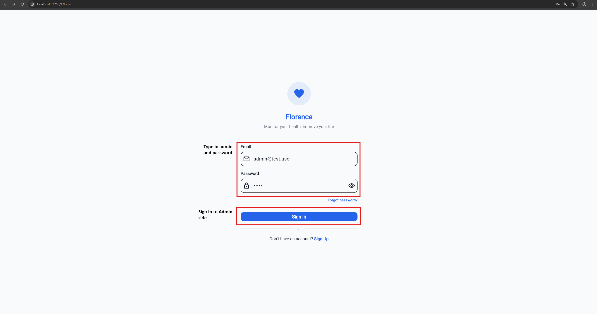

## 3. The Admin Dashboard
The Dashboard serves as mission control, providing a high-level overview of system health and immediate clinical alerts.
### 3.1 Key Performance Index
At the top of the dashboard, four metric cards display real-time system data:
- Total Patients: The total number of active patient profiles.
- High-Risk Patients: Patients requiring manual oversight.
- Hypoglycaemia & Hyperglycaemia: Real-time AI-flagged alerts based on recent blood glucose vitals.
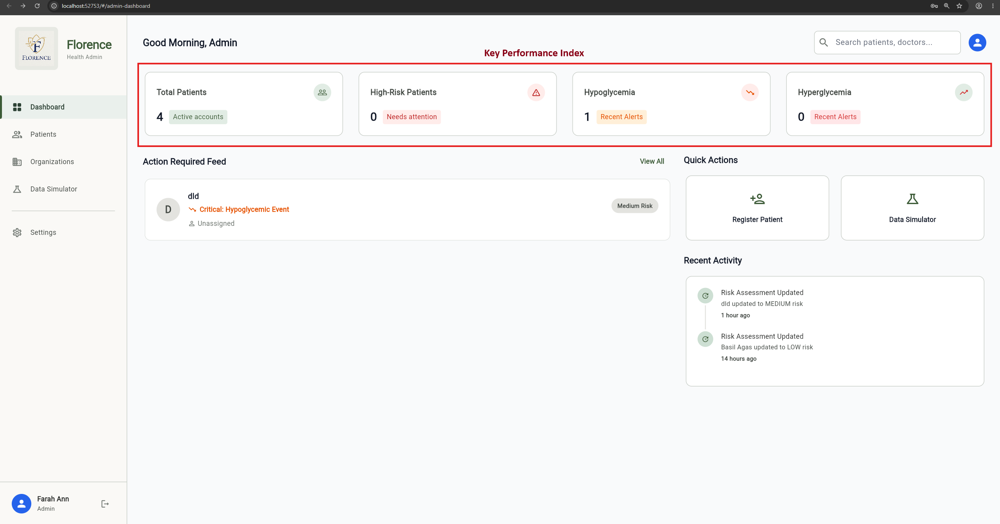

### 3.2 Action Required Feed
This feed dynamically surfaces patients who need immediate attention. If a patient's vitals cross predefined safety thresholds, the system will flag them here with a specific alert (e.g. "Hypoglycaemic Event").
- Selecting View All navigates directly to the Patient Directory.
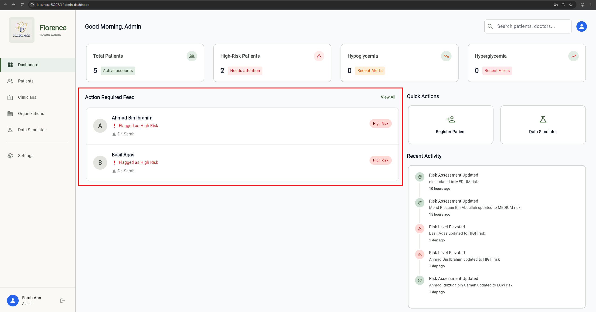

### 3.3 Quick Actions
The Quick Actions grid on the right side of the screen allows rapid execution of common workflows, such as Register Patient without navigating through the sidebar menu.
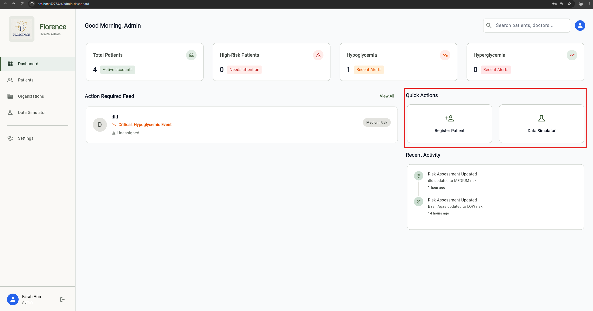

## 4. Patient Management
The Patient Directory allows administrators to search, filter and manage all patient records across the platform.
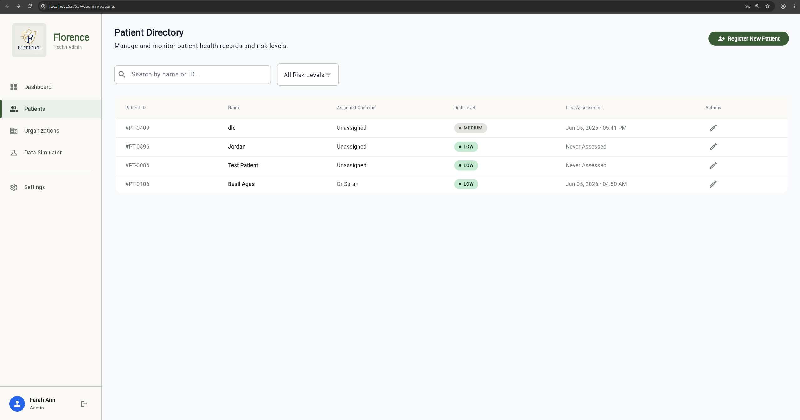

### 4.1 Searching & Filtering
1. The administrator navigates to Patients using the left sidebar.
2. The Search Bar is used to find a patient by Name, Email or Patient ID.
3. The Risk Level Dropdown is used to filter the table (e.g. selecting "High Risk" displays only critical patients).
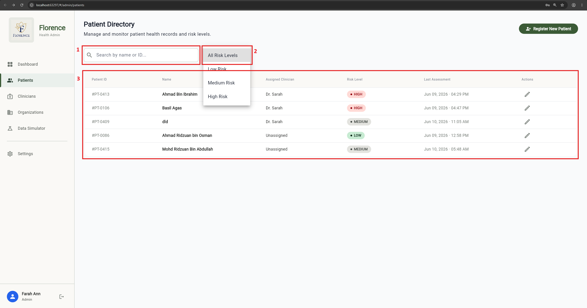

### 4.2 Editing Patient Details & Risk Levels
Administrators can manually override risk assessments or update emergency contact details.
1. The administrator clicks the Edit (Pencil) Icon next to a patient in the directory.
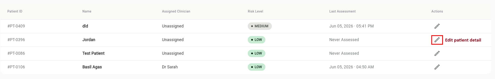
2. Under the Risk Assessment section, the administrator selects a new Risk Level (Low, Medium or High).
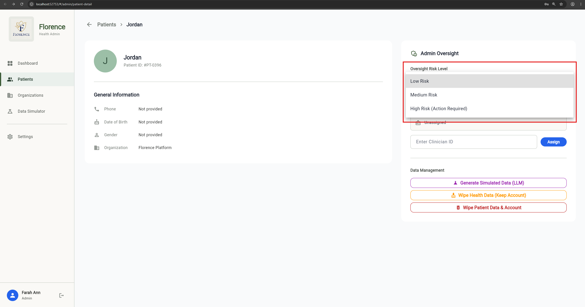
3. The administrator clicks Save Changes. The system will automatically log this action and timestamp the new assessment.
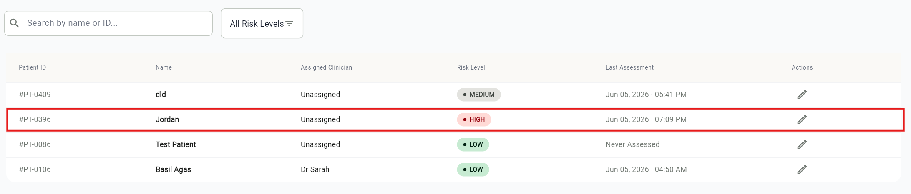

### 4.3 Assigning or Unassigning a Clinician
1. The administrator opens the Patient Detail screen.
2. The administrator locates the Assigned Clinician card.
3. To assign a doctor, the clinician ID is entered.
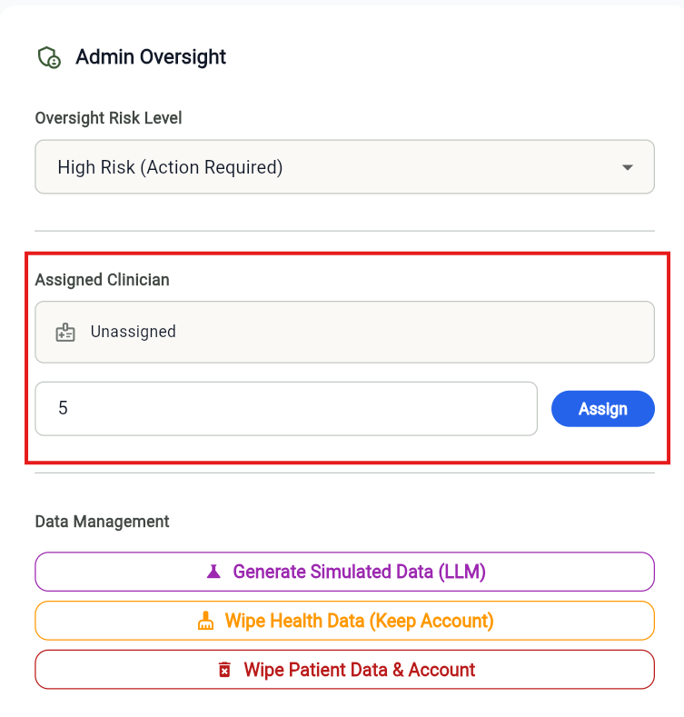
4. To remove a doctor, the administrator clicks the red Unassign button.
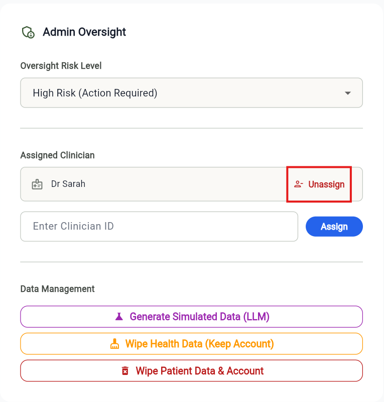

## 5. Organisation Management
The Organisations module is used to onboard and manage the various healthcare facilities, clinics and hospitals utilising the platform.
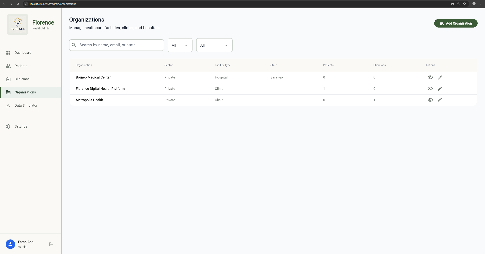

### 5.1 Viewing Organisations
1. The administrator navigates to Organisations using the left sidebar.
2. The data table displays each facility's Sector, Type, State and current active user count (Patients and Clinicians).
3. The administrator clicks the View (Eye) Icon to open the split-view Detail Screen, which separates "Facility Details" from "System Usage" metrics.
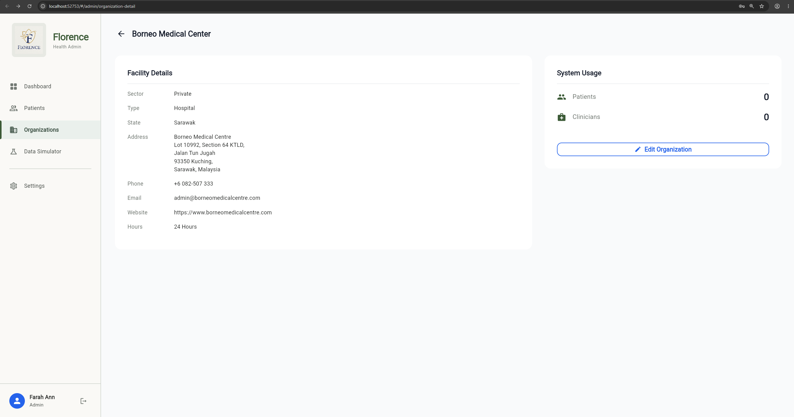

### 5.2 Creating a New Organisation
1. From the Organisations Directory, the administrator clicks the Add Organisation button.
2. The administrator fills in the required fields, including Organisation Name, Sector (e.g. Public, Private) and Facility Type (e.g. Hospital, Clinic).
3. The 24 Hours Operation switch is toggled if applicable. (If toggled off, the facility's operating hours may be manually entered).
4. The administrator clicks Save Changes.
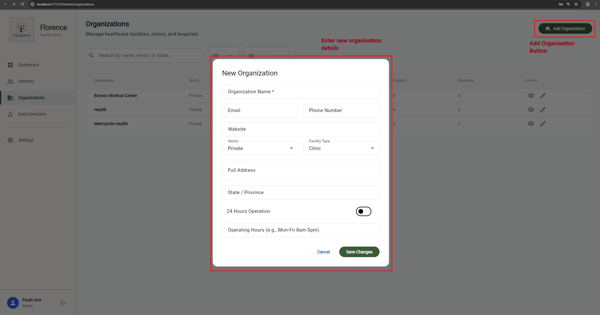
