# Florence: Admin Portal User Manual

## 1. Purpose and Scope

This manual explains how administrators use the Florence Admin Portal to manage patients, clinicians, healthcare organisations, clinical risk oversight, and synthetic clinical test data.

The manual focuses only on implemented admin-side functionality found in the Florence codebase:

- Admin authentication and logout.
- Dashboard metrics, action feed, quick actions, and recent activity.
- Patient registration, search, filtering, profile editing, risk-level override, clinician assignment, and data/account management.
- Clinician registration, search, organisation filtering, editing, and deletion.
- Organisation search, filtering, creation, editing, and detail viewing.
- LLM Data Simulator for creating synthetic patient accounts and test health records.

## 2. Access Requirements

The Admin Portal is intended for authorised administrative users. Admin API endpoints are protected by the backend admin authentication dependency, and the frontend uses an admin login screen before routing users into the admin dashboard.

Administrators should have:

1. An authorised admin email address.
2. A valid password.
4. Permission to manage operational records such as patients, clinicians, and organisations.

Important: Some admin actions are destructive. Wiping health data, deleting a patient account, and deleting a clinician should only be performed after confirming the target record is correct.

## 3. Admin Portal Layout

Most admin screens use a two-column layout:

- **Left sidebar:** Persistent navigation for Dashboard, Patients, Clinicians, Organizations, Data Simulator, Settings, and Logout.
- **Main workspace:** The selected admin page, including tables, filters, forms, and action dialogs.
- **Profile area:** The bottom of the sidebar shows the admin profile card and logout icon.

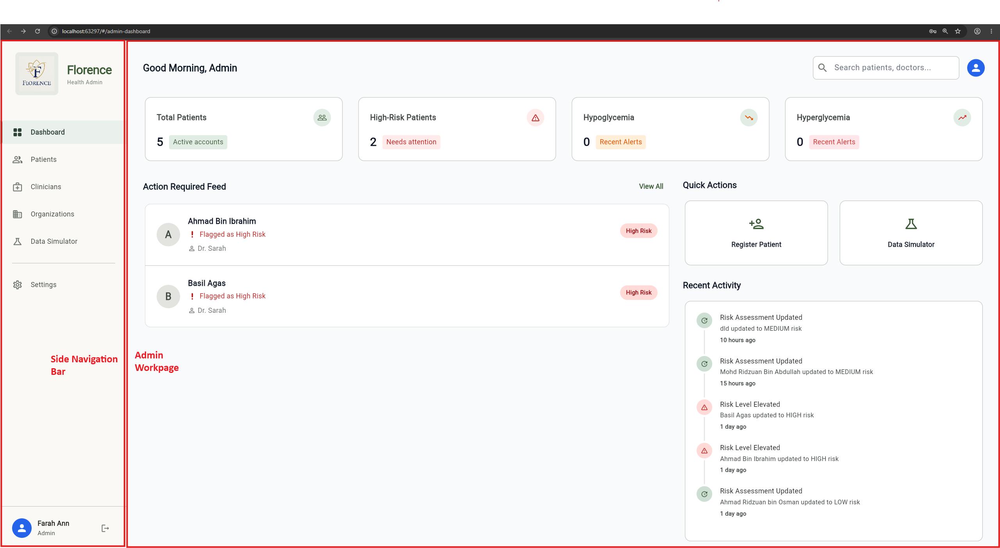

## 4. Logging In

1. Open the Florence login page.
2. Enter the authorised administrator email address.
3. Enter the administrator password.
4. Select **Sign In**.
5. After successful authentication, the system redirects to the Admin Dashboard.

  

### Logging Out

1. Locate the profile card at the bottom of the left sidebar.
2. Select the logout icon.
3. The system clears the admin authentication state, signs out from Supabase, and returns the user to the login flow.

  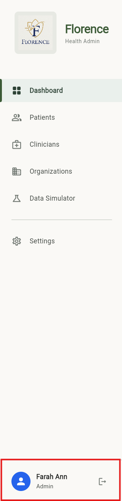

## 5. Admin Dashboard

The Admin Dashboard is the main operational overview for administrators. It summarises system status, clinical alerts, and recent administrative risk updates.

### 5.1 Dashboard Header and Search

The dashboard header displays a greeting and a search field.

The search field filters dashboard attention items by:

- Patient name.
- Clinician name.
- Patient ID.

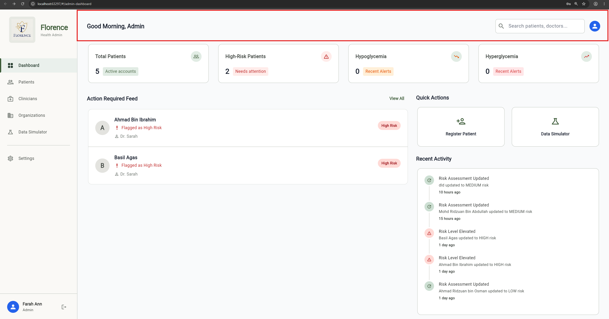

### 5.2 KPI Dashboard

The KPI cards display live metrics derived from the patient list.

Cards shown:

- **Total Patients:** Number of patient profiles returned by the admin patient API.
- **High-Risk Patients:** Number of patients with risk level set to HIGH.
- **Hypoglycemia:** Number of patients with a recent low-glucose alert.
- **Hyperglycemia:** Number of patients with a recent high-glucose alert.

Glucose alert logic is based on recent glucose readings and patient-specific glucose thresholds when available. If patient thresholds are unavailable, the system falls back to default glucose limits.

### 5.3 Action Required Feed

The Action Required Feed lists patients requiring attention. A patient appears in this feed when they are:

- Marked as HIGH risk.
- Flagged for a hypoglycemic event.
- Flagged for a hyperglycemic event.

Each feed item displays:

- Patient initial and name.
- Assigned clinician or **Unassigned**.
- Current risk badge.

To view all patients:

1. Select **View All** in the Action Required Feed header.
2. The system navigates to the Patient Directory.

### 5.4 Quick Actions

The Quick Actions panel provides shortcuts for common workflows.

Current quick actions:

- **Register Patient:** Opens the Register New Patient dialog.
- **Data Simulator:** Opens the LLM Data Simulator page.

### 5.5 Recent Activity

The Recent Activity panel shows recent system activities generated from patient risk assessment updates.

Activity items may show:

- **Risk Level Elevated** when a patient is updated to HIGH risk.
- **Risk Assessment Updated** when a patient's risk level changes.
- Relative time since the event.

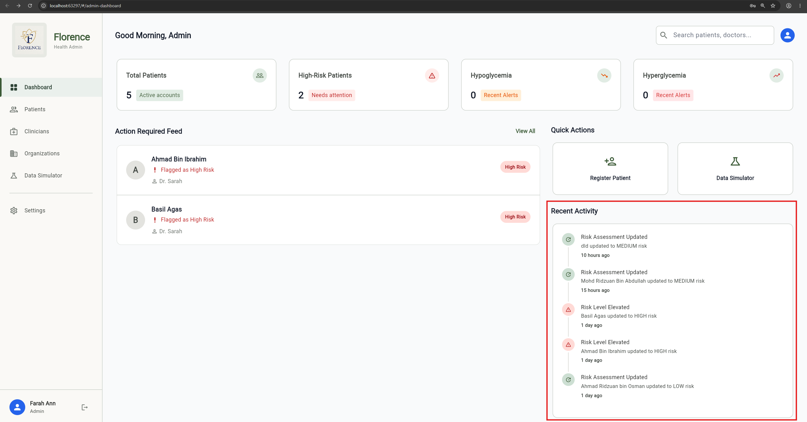

## 6. Patient Management

The Patient Directory allows administrators to register patients, search patients, filter by risk, open patient details, update patient records, assign clinicians, generate test data, and perform controlled data removal.

### 6.1 Opening the Patient Directory

1. Select **Patients** in the left sidebar.
2. The Patient Directory opens.

The table displays:

- Patient ID.
- Name.
- Assigned clinician.
- Risk level.
- Last assessment.
- Action icon.

### 6.2 Searching and Filtering Patients

1. Enter a patient name or ID into **Search by name or ID...**.
2. Select a risk filter from **All Risk Levels**, **Low Risk**, **Medium Risk**, or **High Risk**.
3. The table updates to show matching records.

### 6.3 Registering a New Patient

A patient can be registered from either:

- The Dashboard **Register Patient** quick action.
- The Patient Directory **Register New Patient** button.

Steps:

1. Select **Register Patient** or **Register New Patient**.
2. Enter the patient's full name.
3. Enter the patient's email address.
4. Enter a phone number if available.
5. Select gender.
6. Review or replace the temporary password.
7. Select **Register Patient**.

The system registers the account through the authentication API with the PATIENT role and refreshes the patient list.

  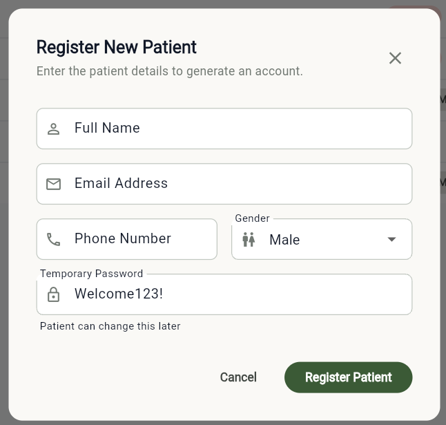

### 6.4 Opening Patient Details

1. In the Patient Directory, locate the patient.
2. Select the pencil/edit icon in the **Actions** column.
3. The Patient Detail screen opens.

The Patient Detail screen includes:

- Breadcrumb navigation back to Patients.
- General patient information.
- Emergency contact information.
- Admin Oversight controls.
- Data Management actions.

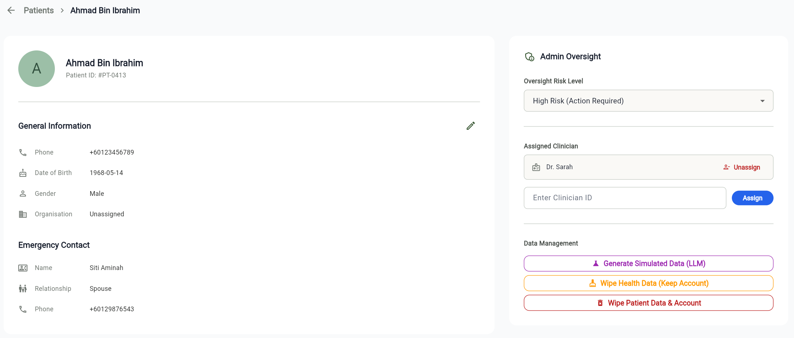

### 6.5 Editing Patient Profile Details

1. Open the Patient Detail screen.
2. Select the edit icon in the **General Information** section.
3. Update editable fields:
   - Full Name.
   - Phone Number.
   - Date of Birth in `YYYY-MM-DD` format.
   - Gender.
   - Organisation.
   - Emergency Contact Name.
   - Emergency Contact Relationship.
   - Emergency Contact Phone.
4. Select **Save Changes**.

The updated patient details are saved to the backend and the patient list is refreshed.

  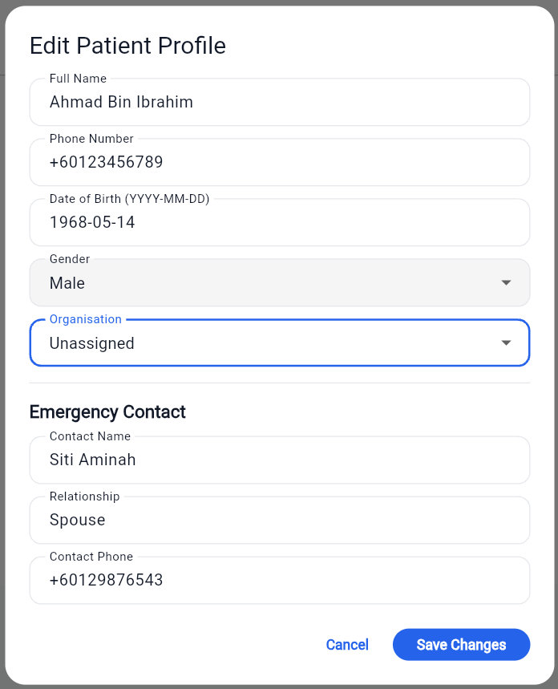

### 6.6 Updating a Patient Risk Level

Administrators can manually override the oversight risk level.

1. Open the Patient Detail screen.
2. In the **Admin Oversight** card, locate **Oversight Risk Level**.
3. Select one of:
   - **Low Risk**.
   - **Medium Risk**.
   - **High Risk (Action Required)**.
4. The system saves the new risk level and updates the last risk assessment timestamp.

After the update succeeds, the updated risk level is reflected in the detail screen, patient table, KPI counts, action feed, and recent activity feed.

### 6.7 Assigning a Clinician to a Patient

1. Open the Patient Detail screen.
2. In the **Admin Oversight** card, locate **Assigned Clinician**.
3. Enter the target clinician's numeric clinician ID in **Enter Clinician ID**.
4. Select **Assign**.
5. The patient list refreshes and the patient returns to the directory view.

  

  

Important: The current UI expects the clinician's numeric database ID. Use the Clinician Directory to confirm the clinician ID before assigning.

### 6.8 Unassigning a Clinician

1. Open the Patient Detail screen for a patient with an assigned clinician.
2. In the **Assigned Clinician** area, select **Unassign**.
3. The system clears the patient's clinician assignment.

  

### 6.9 Generating Simulated Data for an Existing Patient

The Patient Detail screen can generate 30 days of simulated health data for an existing patient.

1. Open the Patient Detail screen.
2. In **Data Management**, select **Generate Simulated Data (LLM)**.
3. Choose a clinical scenario:
   - The Perfect Patient.
   - The Rollercoaster.
   - Dawn Phenomenon.
   - High-Carb Sedentary.
4. Select **Generate**.
5. Wait for generation to complete.

The backend inserts simulated monitor data, daily meal logs, activity logs, long-term vitals, medication/adherence data, and updates the patient's risk level based on the selected scenario.

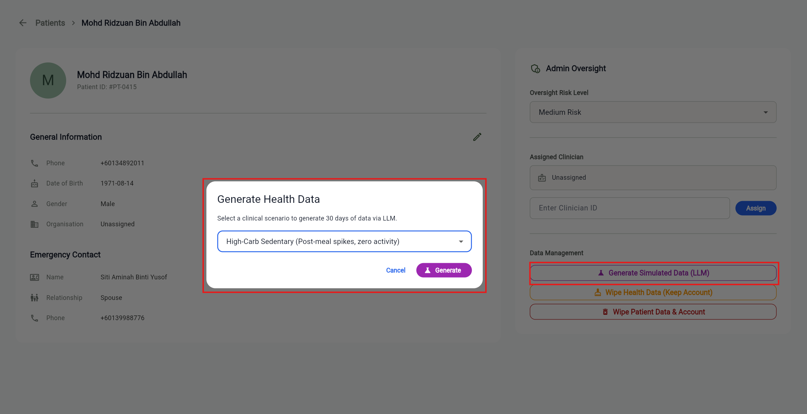

### 6.10 Wiping Patient Health Data While Keeping the Account

This action deletes patient health records while keeping the patient's account and demographic profile.

1. Open the Patient Detail screen.
2. In **Data Management**, select **Wipe Health Data (Keep Account)**.
3. Read the confirmation dialog.
4. Select **Wipe Data** only if the target patient is correct.

This removes health logs, activity records, monitor data, recommendations, chat history, clinical documents, and medication intake logs. It also resets selected AI/risk state fields.

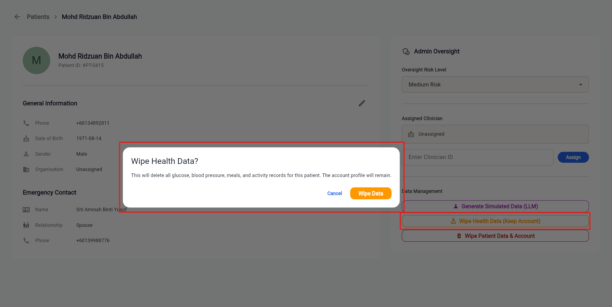

### 6.11 Wiping Patient Data and Account

This action permanently deletes the patient profile and attempts to delete the linked Supabase Auth user.

1. Open the Patient Detail screen.
2. In **Data Management**, select **Wipe Patient Data & Account**.
3. Read the confirmation dialog.
4. Select **Delete Permanently** only if the target account should be removed.

Warning: This action cannot be undone from the Admin Portal.

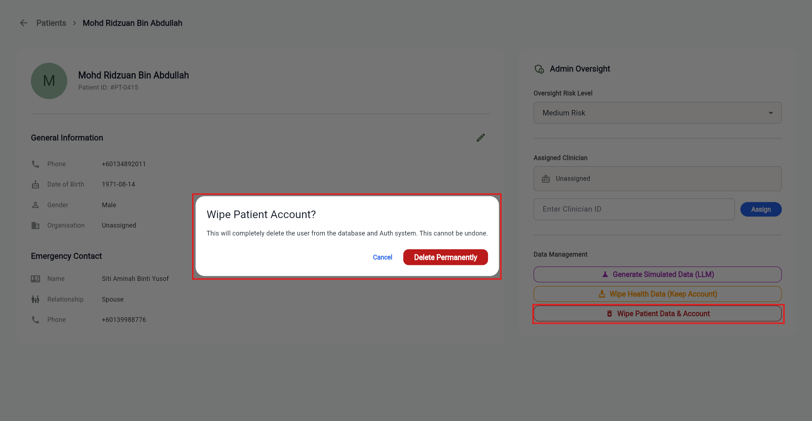

## 7. Clinician Management

The Clinician Directory allows administrators to register clinicians, search clinicians, filter by organisation, edit clinician details, and delete clinician accounts.

### 7.1 Opening the Clinician Directory

1. Select **Clinicians** in the left sidebar.
2. The Clinician Directory opens.

The table displays:

- Clinician ID.
- Name.
- Phone.
- Organisation.
- Assigned Patients.
- Actions.

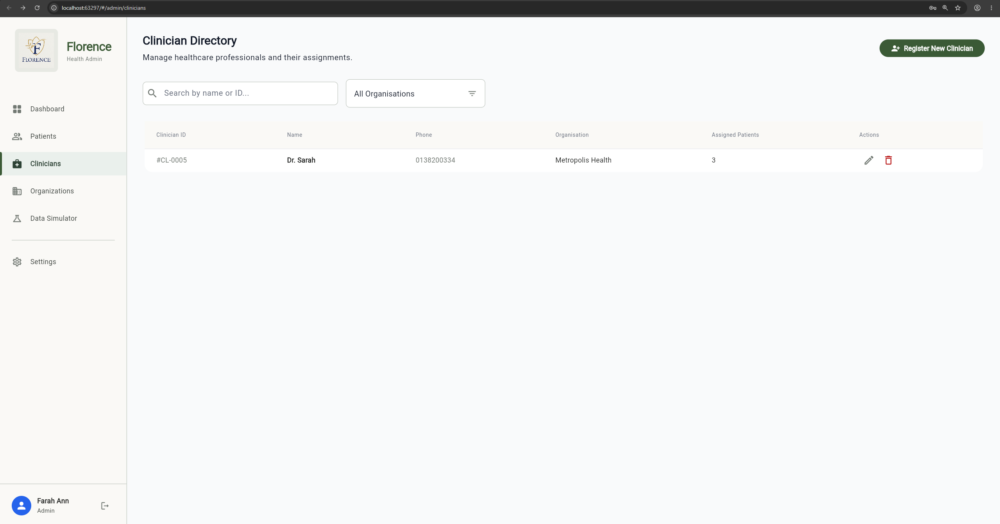

### 7.2 Searching and Filtering Clinicians

1. Enter a clinician name or ID in **Search by name or ID...**.
2. Select an organisation from the organisation dropdown.
3. The clinician table updates to show matching records.

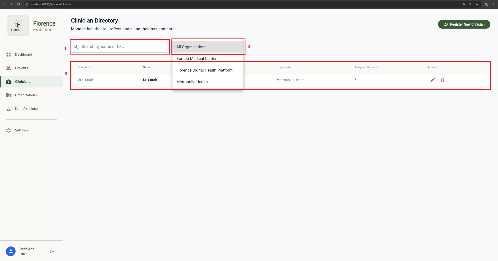

### 7.3 Registering a New Clinician

1. Select **Register New Clinician**.
2. Enter the clinician's full name.
3. Enter the clinician's email address.
4. Enter a phone number if available.
5. Select gender.
6. Select an organisation. This is required.
7. Review or replace the temporary password.
8. Select **Register Clinician**.

The system registers the account through the authentication API with the CLINICIAN role and refreshes the clinician list.

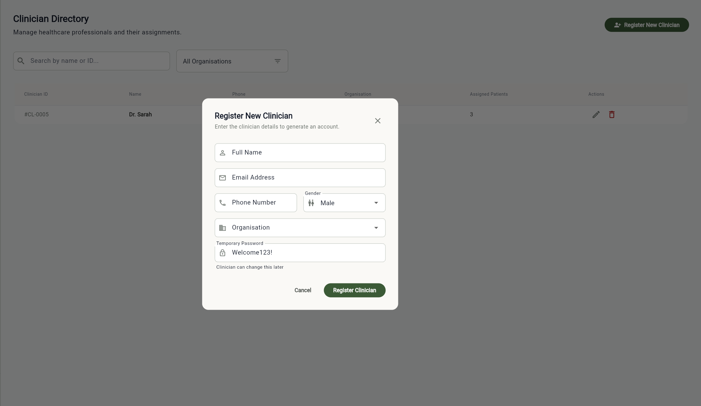

### 7.4 Editing a Clinician

1. In the Clinician Directory, select the edit icon for a clinician.
2. Update editable fields:
   - Name.
   - Phone Number.
   - Gender.
   - Organisation.
3. Select **Save**.

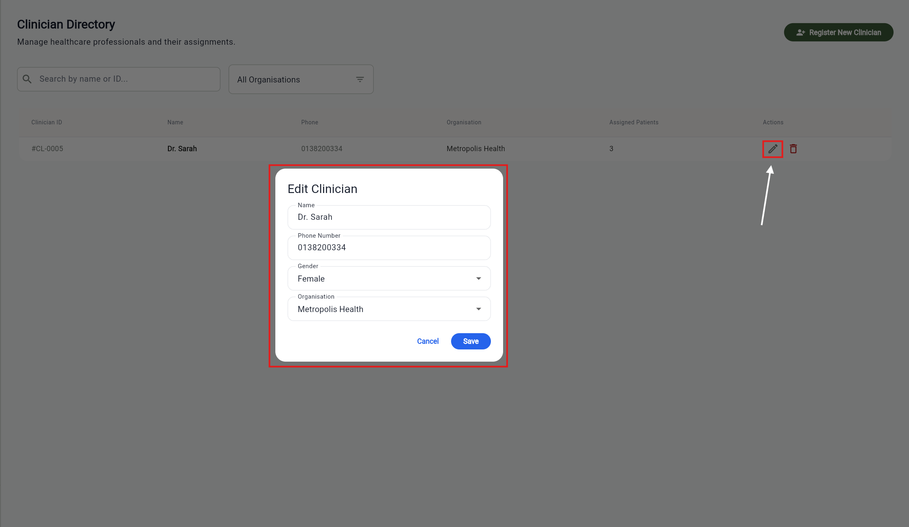

### 7.5 Deleting a Clinician

1. In the Clinician Directory, select the delete icon for a clinician.
2. Read the confirmation dialog.
3. Select **Delete** only if the clinician account should be removed.

When a clinician is deleted, assigned patients are first unassigned to avoid broken assignments. The clinician profile is then deleted and the system attempts to delete the linked auth user.

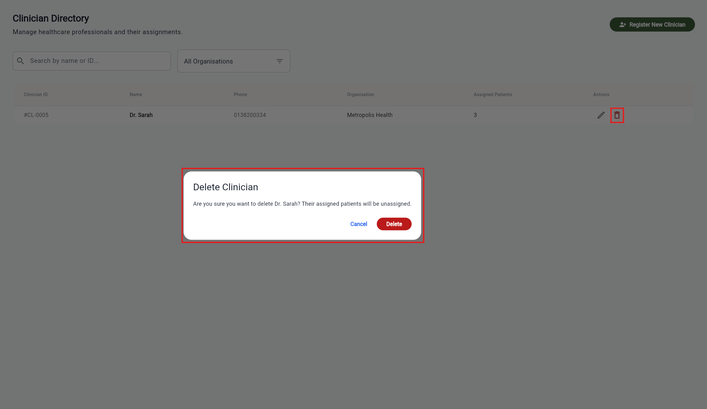

## 8. Organisation Management

The Organizations module manages healthcare facilities, clinics, hospitals, health centres, labs, and other organisations.

### 8.1 Opening the Organizations Directory

1. Select **Organizations** in the left sidebar.
2. The Organizations directory opens.

The table displays:

- Organisation name.
- Sector.
- Facility type.
- State.
- Patient count.
- Clinician count.
- Actions.

### 8.2 Searching and Filtering Organisations

1. Enter text into **Search by name, email, or state...**.
2. Select a sector filter:
   - All.
   - Public.
   - Private.
   - NGO.
   - Other.
3. Select a facility type filter:
   - All.
   - Hospital.
   - Clinic.
   - Health Centre.
   - Lab.
   - Other.
4. The table updates to show matching organisations.

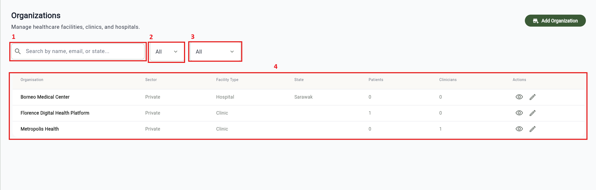

### 8.3 Viewing Organisation Details

1. In the Organizations directory, locate the organisation.
2. Select the eye/view icon.
3. Review the Organisation Detail screen.

The detail screen includes:

- Facility Details:
  - Sector.
  - Type.
  - State.
  - Address.
  - Phone.
  - Email.
  - Website.
  - Hours.
- System Usage:
  - Patient count.
  - Clinician count.
- **Edit Organization** button.

### 8.4 Creating a New Organisation

1. Select **Add Organization**.
2. Enter **Organization Name**. This is required.
3. Enter optional contact details:
   - Email.
   - Phone Number.
   - Website.
4. Select sector.
5. Select facility type.
6. Enter full address.
7. Enter state or province.
8. Enable **24 Hours Operation** if applicable.
9. If the organisation is not 24 hours, enter operating hours.
10. Select **Save Changes**.

### 8.5 Editing an Organisation

An organisation can be edited from:

- The edit icon in the Organizations directory.
- The **Edit Organization** button in the Organisation Detail screen.

Steps:

1. Open the edit dialog.
2. Update the organisation details.
3. Select **Save Changes**.
4. The organisation list refreshes.

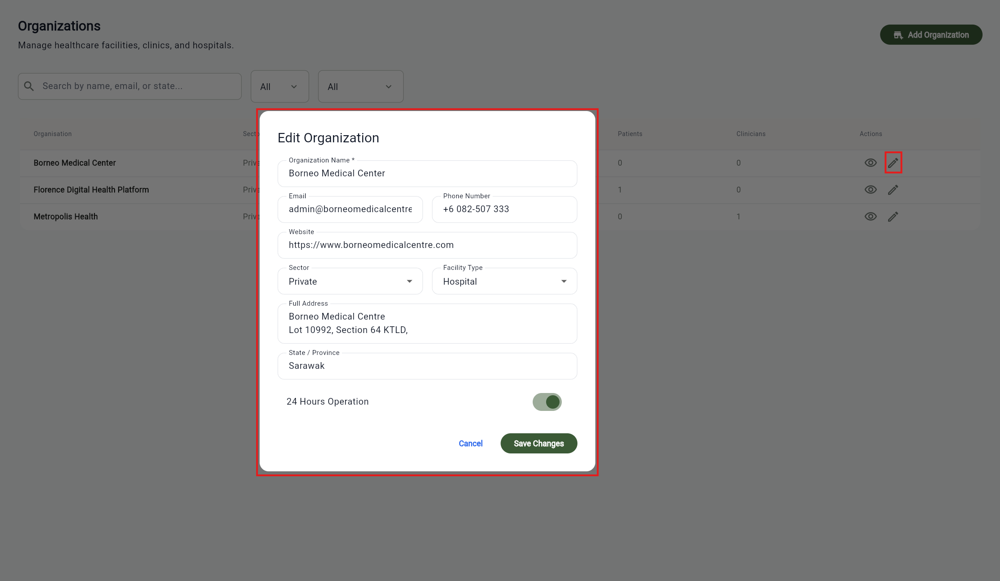

## 9. LLM Data Simulator

The LLM Data Simulator creates a synthetic patient account and generates 30 days of simulated clinical data.

This tool is intended for testing, demonstration, and validation scenarios. It should not be used to create real patient records.

### 9.1 Opening the Data Simulator

1. Select **Data Simulator** in the left sidebar, or select **Data Simulator** from the Dashboard Quick Actions panel.
2. The LLM Data Simulator page opens.

### 9.2 Generating a Synthetic Patient

1. Enter a patient name.
2. Enter a unique email address.
3. Enter a password.
4. Select a clinical persona:
   - **The Perfect Patient:** High time-in-range and regular exercise.
   - **The Rollercoaster:** Frequent highs and lows with erratic eating.
   - **Dawn Phenomenon:** High morning fasting glucose, otherwise normal.
   - **High-Carb Sedentary:** Post-meal spikes and no activity.
5. Select **Generate Patient (30 Days)**.
6. Wait for the LLM generation process to finish.

The simulator:

- Creates a patient auth user.
- Creates a patient profile.
- Inserts default glucose, blood pressure, and related thresholds.
- Inserts 30 days of simulated monitor data, meal logs, activity logs, long-term vitals, medication data, and medication intake logs.
- Assigns a HIGH risk level for selected high-risk scenarios, otherwise LOW.
- Refreshes the patient list.

Generation may take up to approximately 45 seconds because it calls the LLM engine.

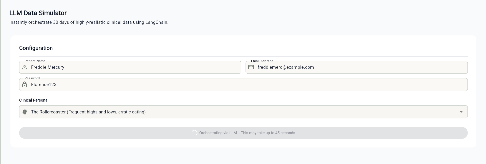

## 10. Common Error and Empty States

The admin UI displays feedback using table empty states, loading indicators, dialogs, and snackbar messages.

Common states:

- **No patients found matching your criteria:** Search or risk filter has no matching patients.
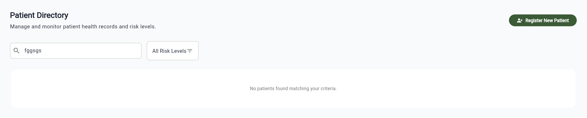

- **No clinicians found matching your criteria:** Search or organisation filter has no matching clinicians.
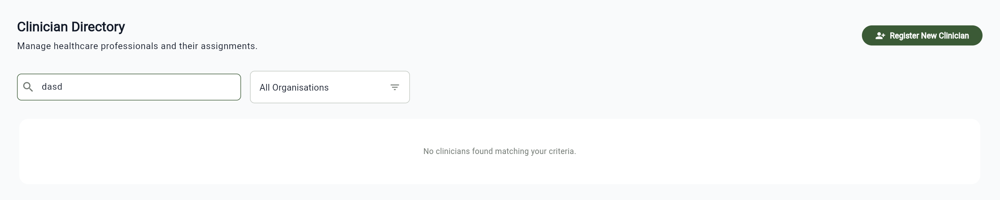

- **No organizations found matching your criteria:** Search, sector, or facility type filter has no matching organisations.
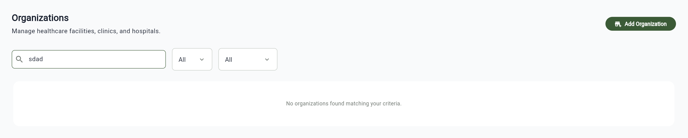

## 12. Safety Checklist for Administrators

Before changing operational records:

1. Confirm the correct patient, clinician, or organisation is selected.
2. For patient risk changes, verify the clinical reason for the override.
3. Before assigning a clinician, confirm the clinician ID in the Clinician Directory.
4. Before wiping health data, confirm that preserving the account but deleting health records is the intended action.
5. Before wiping a patient account, confirm the account should be permanently removed.
6. Before deleting a clinician, confirm that their assigned patients can safely become unassigned.
7. Use the LLM Data Simulator only for synthetic test accounts, not real patient data.