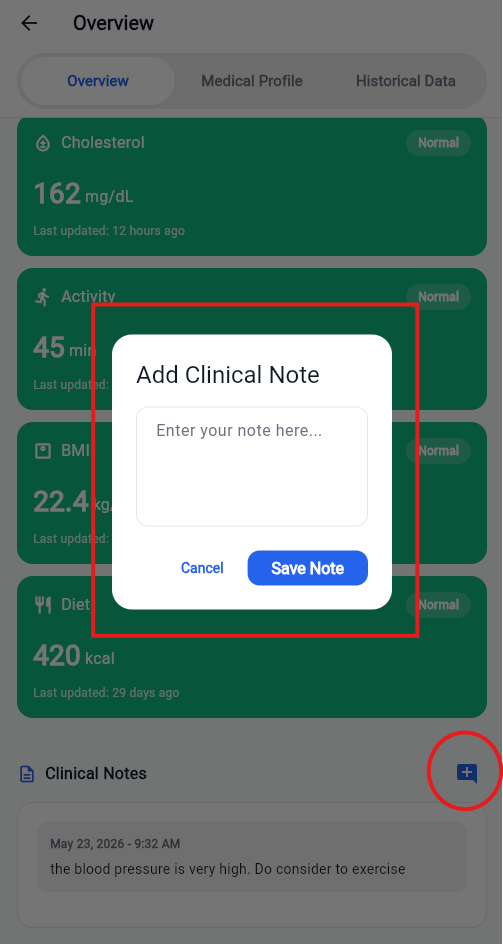

# FLORENCE Clinician Dashboard — User Manual

## 1. Introduction
The FLORENCE Clinician Dashboard is built for speed and secured for healthcare. It provides medical professionals with a streamlined, high-priority command centre that turns scattered patient logs into actionable clinical insights. The goal: Less noise. More signal.

---

## 2. Dashboard & Dynamic Risk Engine (Home Screen)

### 2.1 Overview of the Home Screen
Upon logging in, you are presented with the main command centre. This screen is desigvned to highlight patients requiring immediate attention.

---

### 2.2 Key Features of the Home Screen
1.  **Search & Filter [Box 1]**: Quickly find patients by typing their name or ID. Tap the filter icon to expand advanced filters (e.g., filtering by specific risk levels or update recency).
2.  **Dynamic Sorting [Box 2]**: The patient list is NOT alphabetical. It is driven by a live Dynamic Risk Engine. Patients flagged as "High" or "Medium" risk automatically float to the top of your queue based on real-time continuous data flows from their patient app.
3.  **Priority Alerts [Box 3]**: If a patient breaches critical thresholds (e.g., consecutive fasting glucose readings > 10.0 mmol/L or hypertensive crisis readings), a **Priority Alert** card appears here. It displays the patient's name, the specific trigger, and the time elapsed. Tap **View Details** to investigate immediately.

---

## 3. Patient Overview & Demographics

### 3.1 Holistic Patient View
Clicking on any patient from your list opens their comprehensive profile, defaulting to the **Overview** tab.

---

### 3.2 Understanding the Overview Tab
1.  **Demographics & Baseline [Box 1]**: Displays essential patient identifiers, age, gender, and emergency contact details. It also features an **Edit** button (pencil icon) to update profile details.
2.  **Current Status Grid [Box 2]**: A stack of vital metrics cards showing the latest logged values. Each card is colour-coded by its current risk status:
    *   **Green (Normal)**: On track and within target thresholds.
    *   **Amber (Elevated/Low)**: Out of range; requires monitoring.
    *   **Red (High/Critical)**: Significantly out of range; requires immediate clinical review.
    *   **Grey (No Data)**: No readings logged yet.
3.  **Clinical Notes [Box 3]**: Displays persistent, chronological notes from you and your clinical team. Tap the **Add Note** icon to append a new entry.

---

## 4. Historical Data & Dynamic Analytics

### 4.1 Navigating to Historical Data
To view detailed trends and long-term patient data, navigate to the **Historical Data** tab.

---

### 4.2 Glucose Analytics Screen
Clicking on the **Glucose** summary card in the **Historical Data** tab opens the dedicated Glucose Analytics Screen.

#### **Key Features:**
1.  **Timeframe Filters [Box 1]**: Toggle between daily, weekly, and monthly views. Use the chevron arrows to navigate back and forth in time.
2.  **Smart Charts [Box 2]**: The charts dynamically scale their intervals so that even months of daily data remain readable without label overlap. Shaded bands represent the patient's personalised target safe zones.
3.  **Status Pills [Box 3]**: Below the charts, individual logged entries are listed chronologically and flagged with status pills (e.g., "ABOVE TARGET", "BELOW TARGET", "NORMAL") for rapid clinical assessment.

---

### 4.3 HbA1c Analytics Screen
Clicking on the **HbA1c** summary card in the **Historical Data** tab opens the dedicated HbA1c Analytics Screen.

#### **Key Features:**
1.  **Actual vs. Goal [Box 1]**: A clean, side-by-side bar chart comparing the patient's latest HbA1c reading against their target. A status card below immediately flags whether they are within target.
2.  **HbA1c Trends [Box 2]**: A line chart showing long-term control over months. Shaded bands represent the patient's target safe zones.
3.  **Status Pills [Box 3]**: Below the charts, individual logged entries are listed chronologically and flagged with status pills (e.g., "ABOVE TARGET", "BELOW TARGET", "NORMAL") for rapid clinical assessment.

---

### 4.4 Blood Pressure Analytics Screen
Clicking on the **Blood Pressure** summary card in the **Historical Data** tab opens the dedicated Blood Pressure Analytics Screen.

#### **Key Features:**
1.  **Target Ranges [Box 1]**: Displays the patient's personalised target ranges for both Systolic and Diastolic pressure.
2.  **Averages [Box 2]**: Displays the patient's average Systolic and Diastolic pressure for the selected period.
3.  **Blood Pressure Trends [Box 3]**: A line chart showing both Systolic and Diastolic lines. Shaded bands represent the patient's target safe zones.
4.  **Status Pills [Box 4]**: Below the charts, individual logged entries are listed chronologically and flagged with status pills (e.g., "HIGH", "NORMAL", "LOW") for rapid clinical assessment.

---

### 4.5 Cholesterol Analytics Screen
Clicking on the **Cholesterol** summary card in the **Historical Data** tab opens the dedicated Cholesterol Analytics Screen.

#### **Key Features:**
1.  **Cholesterol Ratio [Box 1]**: A clean, circular gauge comparing the patient's HDL against their Non-HDL cholesterol. A status card below immediately flags whether they are within target.
2.  **Metric Selector [Box 2]**: Toggle between Total, LDL, HDL, and Triglycerides views.
3.  **Cholesterol Breakdown [Box 3]**: A line chart showing long-term control over months. Shaded bands represent the patient's target safe zones.
4.  **Status Pills [Box 4]**: Below the charts, individual logged entries are listed chronologically and flagged with status pills (e.g., "HIGH", "NORMAL", "LOW") for rapid clinical assessment.

---

### 4.6 Physical Activity Analytics Screen
Clicking on the **Physical Activity** summary card in the **Historical Data** tab opens the dedicated Physical Activity Analytics Screen.

#### **Image Highlight Instructions (No image file, text-only directions for UI layout):**
*   **[Box 1]** Around the **Today's Movement Active Minutes Display** (showing active minutes and sessions).
*   **[Box 2]** Around the **Activity Streak Heatmap Grid** (showing a 28-day view of activity).
*   **[Box 3]** Around the **Weekly Consistency Bar Chart** (showing steps vs target).

#### **Key Features:**
1.  **Today's Movement [Box 1]**: Displays the patient's active minutes and sessions for today.
2.  **Activity Streak [Box 2]**: A 28-day heatmap grid showing a visual representation of the patient's activity. Green represents active days, light green represents less active days, and grey represents inactive days.
3.  **Weekly Consistency [Box 3]**: A bar chart showing the patient's steps vs target. Green represents days where the target was met, amber represents days where the target was partially met, and red represents days where the target was not met.

---

### 4.7 Diet Log & Nutrition Summary
Clicking on the **Diet Log** summary card in the **Historical Data** tab opens the dedicated Diet Log & Nutrition Summary Screen.

#### **Image Highlight Instructions (No image file, text-only directions for UI layout):**
*   **[Box 1]** Around the **Diet Log List** showing meal types (Breakfast, Lunch, Dinner, Snack).
*   **[Box 2]** Around the **Nutrient Chips** (Carbs, Protein, Fat).
*   **[Box 3]** Around the **Automated Actions Log** (Reminders, Tips, Prompts).

#### **Key Features:**
1.  **Diet Log List [Box 1]**: Displays the patient's logged meals chronologically. Each entry shows the meal type, timestamp, and food items.
2.  **Nutrient Chips [Box 2]**: Displays the patient's macronutrient breakdown for each meal.
3.  **Automated Actions Log [Box 3]**: Displays the patient's automated actions log. Each entry shows the action type, timestamp, and description.

---

## 5. Taking Clinical Action

### 5.1 Managing Medical Conditions & Medications
Navigate to the **Medical Profile** tab to manage the patient's clinical background and active prescriptions.

#### **Image Highlight Instructions (No image file, text-only directions for UI layout):**
*   **[Box 1]** Around the **Medical Conditions Card** (highlighting the "Add New Condition" button and the Active/Resolved/All filters).
*   **[Box 2]** Around the **Health Thresholds Card** (highlighting the "Edit" button).
*   **[Box 3]** Around the **Current Medications Card** (highlighting the "Add New Medication" button).

#### **Clinical Actions:**
*   **Add/Edit Conditions [Box 1]**: Tap the add icon to record a new diagnosis. Use the popup menu on existing conditions to mark them as resolved or edit details.
*   **Customise Thresholds [Box 2]**: Tap the edit icon to adjust the patient's personalised target ranges. These values are used by the Dynamic Risk Engine to calculate risk levels.
*   **Prescribe Medications [Box 3]**: Tap the add icon to open the medication form. Search the global dictionary, set the dosage, frequency, and specific timing instructions (e.g., "BEFORE_BREAKFAST").

---

### 5.2 Adding Clinical Notes
To record observations, treatment adjustments, or consultation summaries, tap the **Add Note** button on the patient's Overview tab.

#### **Image Highlight Instructions:**
Please overlay **two red highlight boxes** on the image above, numbered as follows:
*   **[Box 1]** Around the **Text Input Field** where the note content is entered.
*   **[Box 2]** Around the **Save Note** button.

#### **Clinical Actions:**
1.  **Enter Note [Box 1]**: Type your clinical observations or treatment adjustments.
2.  **Save Note [Box 2]**: Tap **Save Note**. Because the dashboard operates on a strict "Zero Direct Database" policy, your note is securely routed through the FLORENCE middleware REST API. The note immediately syncs across the platform, updating the priority queue and context for your entire clinical team in real-time.

---

## 6. Clinician Profile & Preferences

### 6.1 Accessing the Profile
To view your account details, update your personal information, or modify your unit preferences, tap the **Profile** icon in the top-right corner of the Home Screen.

#### **Image Highlight Instructions (No image file, text-only directions for UI layout):**
*   **[Box 1]** Around the **Account Information Card** (containing your name, gender, and mobile number) with the "Edit Profile" button.
*   **[Box 2]** Around the **Unit Preferences Card** (containing Glucose Unit and Cholesterol Unit selectors).
*   **[Box 3]** Around the **System Information Card** (containing your email and Organisation ID).
*   **[Box 4]** Around the **Logout Button** at the bottom.

---

### 6.2 Modifying Unit Preferences (Glucose & Cholesterol)
The FLORENCE platform supports both metric and imperial units for clinical data. You can customise these preferences to match your clinical practice.

#### **Clinical Actions:**
1.  **Glucose Unit [Box 2]**: Tap the **Glucose Unit** row. A bottom sheet will appear allowing you to select between **mmol/L** and **mg/dL**. Once selected, all glucose readings across the dashboard will automatically convert and display in your preferred unit.
2.  **Cholesterol Unit [Box 2]**: Tap the **Cholesterol Unit** row. A bottom sheet will appear allowing you to select between **mmol/L** and **mg/dL**. Once selected, all cholesterol readings across the dashboard will automatically convert and display in your preferred unit.
3.  **Automatic Sync**: Any changes made to your unit preferences are immediately saved to your profile via the FLORENCE middleware REST API and will persist across sessions.
