# Florence: User Manual - Clinician Portal

---

## 1. Introduction
The Florence clinician dashboard is built for speed and secured for healthcare. It provides medical professionals with a streamlined, high-priority command centre that turns scattered patient logs into actionable clinical insights. The goal: Less noise. More signal.

---

## 2. Dashboard and Dynamic Risk Engine (Home Screen)

### 2.1. Overview of the Home Screen
Upon logging in, the clinician is presented with the main command centre. This screen is designed to highlight patients requiring immediate attention.

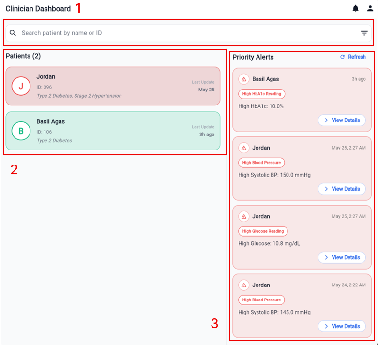

### 2.2. Key Features of the Home Screen
1.  **Search and filter [Box 1]**: Quickly find patients by typing a name or ID. Tapping the icon at the right side of the search bar expands filters (e.g. filtering by specific risk levels or update recency).
2.  **Dynamic sorting [Box 2]**: The patient list is NOT alphabetical. It is driven by a live Dynamic Risk Engine. Patients flagged as "High" or "Medium" risk automatically float to the top of the queue based on real-time continuous data flows from the patient app.
3.  **Priority Alerts [Box 3]**: If a patient breaches thresholds (e.g. consecutive fasting glucose readings > 10.0 mmol/L or hypertensive crisis readings), a *priority alert* card appears here. It displays the patient's name, the specific trigger and the time elapsed. Selecting *View Details* allows immediate investigation.

---

## 3. Patient Overview and Demographics

### 3.1. Holistic Patient View
Clicking on any patient from the list opens a comprehensive profile, defaulting to the *Overview* tab.

### 3.2. Understanding the Overview Tab
1.  **Demographics and Baseline [Box 1]**: Displays essential patient identifiers, age, gender and emergency contact details. It also features an *Edit* button (pencil icon) to update profile details.
2.  **Current Status grid [Box 2]**: A stack of vital metrics cards showing the latest logged values. Each card is colour-coded by its current risk status:
    *   **Green (Normal)**: On track and within target thresholds.
    *   **Amber (Elevated/Low)**: Out of range, requires monitoring.
    *   **Red (High/Critical)**: Significantly out of range, requires immediate clinical review.
    *   **Grey (No Data)**: No readings logged yet.
3.  **Clinical Notes [Box 3]**: Displays persistent, chronological notes from the clinician and the clinical team. Selecting the *Add Note* icon appends a new entry.

---

## 4. Historical Data and Dynamic Analytics

### 4.1. Navigating to Historical Data
To view detailed trends and long-term patient data, the clinician navigates to the *Historical Data* tab.

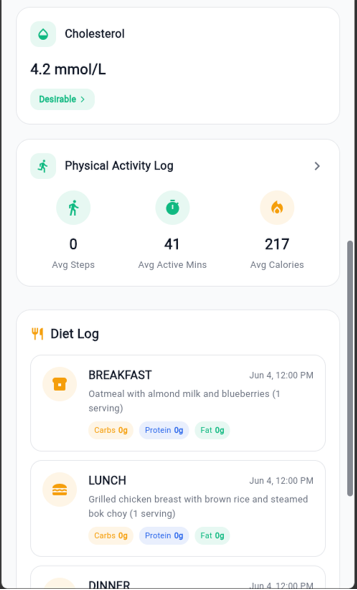

### 4.2. Glucose Analytics Screen
Clicking on the *Glucose* summary card in the *Historical Data* tab opens the dedicated Glucose Analytics screen.

**Key Features:**
1.  **Timeframe filters [Box 1]**: Toggle between daily, weekly and monthly views. The chevron arrows allow navigation back and forth in time.
2.  **Smart charts [Box 2]**: The charts dynamically scale their intervals so that even months of daily data remain readable without label overlap. Shaded bands represent the patient's personalised target safe zones.
3.  **Status pills [Box 3]**: Below the charts, individual logged entries are listed chronologically and flagged with status pills (e.g. "ABOVE TARGET", "BELOW TARGET", "NORMAL") for rapid clinical assessment.

### 4.3. HbA1c Analytics Screen
Clicking on the *HbA1c* summary card in the *Historical Data* tab opens the dedicated HbA1c Analytics screen.

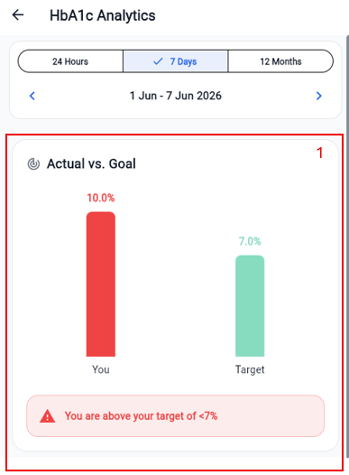
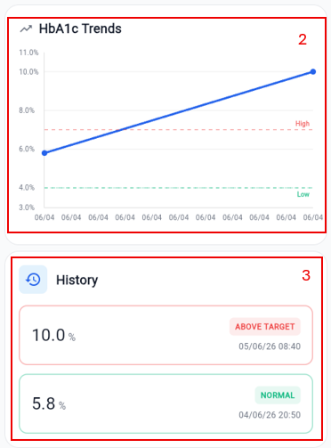

**Key Features:**
1.  **Actual vs. Goal [Box 1]**: A clean, side-by-side bar chart comparing the patient's latest HbA1c reading against the target. A status card below immediately flags whether the patient is within target.
2.  **HbA1c Trends [Box 2]**: A line chart showing long-term control over months. Shaded bands represent the patient's target safe zones.
3.  **Status pills [Box 3]**: Below the charts, individual logged entries are listed chronologically and flagged with status pills (e.g. "ABOVE TARGET", "BELOW TARGET", "NORMAL") for rapid clinical assessment.

### 4.4. Blood Pressure Analytics Screen
Clicking on the *Blood Pressure* summary card in the *Historical Data* tab opens the dedicated Blood Pressure Analytics screen.

**Key Features:**
1.  **Target Ranges [Box 1]**: Displays the patient's personalised target ranges for both Systolic and Diastolic pressure.
2.  **Averages [Box 2]**: Displays the patient's average Systolic and Diastolic pressure for the selected period.
3.  **Blood Pressure Trends [Box 3]**: A line chart showing both Systolic and Diastolic lines. Shaded bands represent the patient's target safe zones.
4.  **Status pills [Box 4]**: Below the charts, individual logged entries are listed chronologically and flagged with status pills (e.g. "HIGH", "NORMAL", "LOW") for rapid clinical assessment.

### 4.5. Cholesterol Analytics Screen
Clicking on the *Cholesterol* summary card in the *Historical Data* tab opens the dedicated Cholesterol Analytics screen.
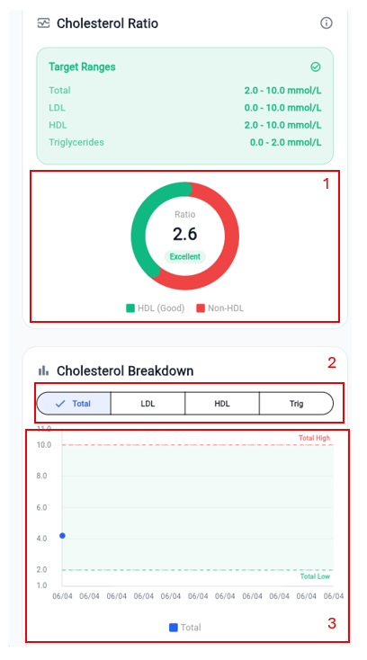

**Key Features:**
1.  **Cholesterol Ratio [Box 1]**: A clean, circular gauge comparing the patient's HDL against non-HDL cholesterol. A status card below immediately flags whether the patient is within target.
2.  **Metric selector [Box 2]**: Toggle between Total, LDL, HDL and Triglycerides views.
3.  **Cholesterol Breakdown [Box 3]**: A line chart showing long-term control over months. Shaded bands represent the patient's target safe zones.
4.  **Status pills [Box 4]**: Below the charts, individual logged entries are listed chronologically and flagged with status pills (e.g. "HIGH", "NORMAL", "LOW") for rapid clinical assessment.

### 4.6. Physical Activity Analytics Screen
Clicking on the *Physical Activity* summary card in the *Historical Data* tab opens the dedicated Activity Analytics screen.

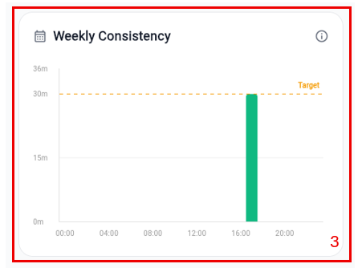

**Key Features:**
1.  **Today's movement [Box 1]**: Displays the patient's active minutes and sessions for today.
2.  **Activity Streak [Box 2]**: A 28-day heatmap grid showing a visual representation of the patient's activity. Green represents active days, light green represents less active days and grey represents inactive days.
3.  **Weekly Consistency [Box 3]**: A bar chart showing the patient's steps vs target. Green represents days where the target was met, amber represents days where the target was partially met and red represents days where the target was not met.

### 4.7. Diet Log and Nutrition Summary
Clicking on the *View all entries* button shows all diet logs. *Diet Log* section can be found inside the *Historical Data* tab.

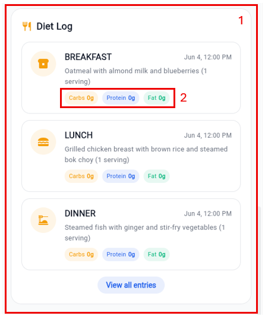
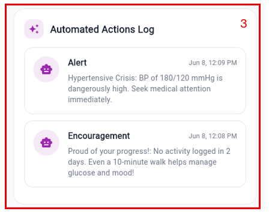

**Key Features:**
1.  **Diet Log list [Box 1]**: Displays the patient's logged meals chronologically. Each entry shows the meal type, timestamp and food items.
2.  **Nutrient chips [Box 2]**: Displays the patient's macronutrient breakdown for each meal.
3.  **Automated Actions Log [Box 3]**: Displays the patient's automated actions log. Each entry shows the action type, timestamp and description.

---

## 5. Taking Clinical Action

### 5.1. Managing Medical Conditions and Medications
The clinician navigates to the *Medical Profile* tab to manage the patient's clinical background, target thresholds and active prescriptions. This tab serves as the clinical core for personalising patient care.

#### Detailed Button Functions and Clinical Workflows
1. **Medical Conditions Card**

    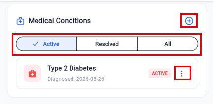

    This card displays the patient's active and resolved diagnoses.
    *   **Add New Condition button (plus icon)**: Tapping this button opens the *Add Medical Condition* dialog.
        *   **Condition Name**: The clinician enters the diagnosis (e.g. "Type 2 Diabetes", "Hypertension", etc.)
        *   **Status Context dropdown**: The clinician selects *Active* (for ongoing management) or *Resolved* (for historical context).
        *   **Diagnosed Date**: Tapping this opens a calendar date picker to log the exact onset date.
        *   **Add Entry button**: Submits the record, immediately updating the patient's clinical profile.
    *   **Active/Resolved/All segmented filter**: Tapping these segments instantly filters the list. This helps the clinician quickly isolate active issues during a consultation without being distracted by resolved history.
    *   **More options button (three-dot icon)**: Located next to each condition. Tapping this opens a context menu:
        *   **Mark as Resolved/Active**: Instantly toggles the condition's status and moves it to the appropriate filtered list.
        *   **Edit Details**: Re-opens the dialog to correct names or onset dates.
        *   **Remove**: Permanently deletes the condition from the patient's record after a confirmation prompt.

 

2. **Health Thresholds Card**

    

    This card displays the patient's personalised target ranges for vitals (Glucose, Blood Pressure, HbA1c, Cholesterol and BMI). These thresholds are critical because the *Dynamic Risk Engine* uses them to determine the patient's risk level and float the patient to the top of the home screen queue.
    *   **Edit button (pencil icon)**: Tapping this opens the *Health Thresholds* management dialog.
        *   **Threshold list**: Displays all vitals with their current min/max values.
        *   **Edit single threshold (pencil icon)**: Tapping the edit icon next to any vital (e.g. Glucose) opens the *Edit* dialog.
        *   **Minimum/Maximum Value fields**: The clinician enters the new clinical targets. The units automatically match the preferred clinician settings (e.g. mmol/L or mg/dL).
        *   **Save button**: Securely updates the targets. The patient's app and the risk engine sync instantly.

 

3. **Current Medications Card**

    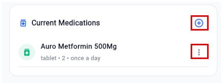

    This card displays the patient's active prescriptions and schedule.
    *   **Add New Medication button (plus icon)**: Tapping this opens the *Add Medication* form.
        *   **Medication Name (smart autocomplete)**: Typing a brand or generic name queries the global medication dictionary in real-time to prevent spelling errors and ensure clinical accuracy. A custom name can also be typed if it is not in the dictionary.
        *   **Amount and Type**: The clinician enters the dosage quantity (e.g. "1", "500", etc.) and selects the form (e.g. "Tablet", "Capsule", "Injection", "ml", etc.)
        *   **Frequency dropdown**: The clinician selects how often the medication should be taken (e.g. "Twice daily", "Three times daily", etc.)
        *   **Specific Timings (dynamic fields)**: The form dynamically generates dropdown fields based on the selected frequency (e.g. showing "1st Dose" and "2nd Dose" for twice-daily frequency). The clinician selects precise clinical instructions for each dose (e.g. "Before Breakfast", "After Dinner", "Before Bed", etc.)
        *   **Add Medication button**: Saves the prescription. This automatically generates a daily logging schedule in the patient's mobile app.
    *   **Show Menu button (three-dot icon)**: Located next to each medication. Tapping this allows the clinician to:
        *   **Edit Details**: Modify dosage, frequency or timing instructions.
        *   **Remove**: Discontinue and delete the medication from the patient's active schedule.

### 5.2. Adding Clinical Notes
To record observations, treatment adjustments or consultation summaries, the clinician taps the *Add Note* button on the patient's *Overview* tab.

**Clinical Actions:**
1.  **Enter bote [Box 1]**: The clinician types clinical observations or treatment adjustments.
2.  **Save Note button [Box 2]**: When the clinician taps *Save Note*, the note immediately syncs across the platform, updating context for the entire clinical team in real-time.

---

## 6. Clinician Profile and Preferences

### Accessing the Profile
To view account details, update personal information or modify unit preferences, the clinician taps the *Profile* icon in the top-right corner of the *Home Screen*.

### Detailed Card Descriptions and Clinical Actions

1. **Account Information Card**

    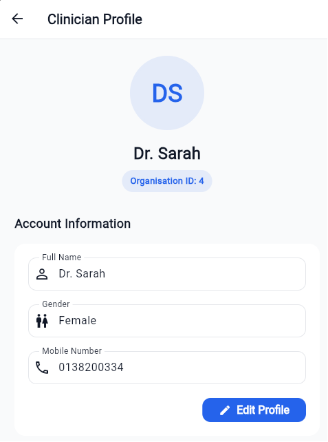

    This card displays the clinician's personal clinical identity details used across the platform.
    *   **What it is:** A card containing editable profile details: Full Name, Gender and Mobile Number.
    *   **What it does"** Allows the clinician to keep contact details and identity up to date so that patients and other clinical staff can identify, and contact the clinician correctly.
    *   **How to use it:**
        1.  The clinician taps the *Edit Profile* button in the bottom-right corner of the card. The fields will switch from read-only to editable text fields.
        2.  The clinician modifies the *Full Name* or *Mobile Number* as needed.
        3.  The clinician selects the *Gender* from the dropdown menu.
        4.  The clinician taps *Save Changes* to commit the updates or taps *Cancel* to discard any edits and restore the previous values.

 

2. **Unit Preferences Card**

    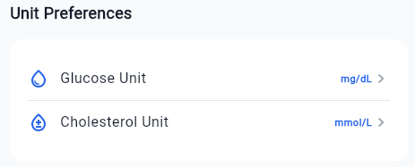

    This card controls how clinical metrics are displayed throughout the entire dashboard.
    *   **What it is:** A preference card containing selectors for *Glucose Unit* and *Cholesterol Unit*.
    *   **What it does:** Customises the display units for all patient vitals across the dashboard. Changing these units automatically converts and displays all historical readings, charts and thresholds in the preferred format (e.g. converting glucose from mmol/L to mg/dL).
    *   **How to use it:**
        1.  The clinician taps the *Glucose Unit* row to open a bottom sheet selector and chooses between *mmol/L* and *mg/dL*.
        2.  The clinician taps the *Cholesterol Unit* row to open a bottom sheet selector and chooses between *mmol/L* and *mg/dL*.
        3.  The platform instantly recalculates and updates all charts, tables and status cards across the app. The preferences are saved to the profile and persist across logins.

 

3. **System Information and Organisation Information Cards**

    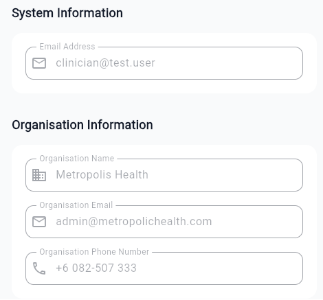

    These cards display immutable system credentials and detailed organisational context.
    *   **What they are:** Two read-only cards. The *System Information* card displays the registered *Email Address*. The *Organisation Information* card displays the assigned facility's *Organisation Name*, *Organisation Email* and *Organisation Phone Number*.
    *   **What they do:** Provide essential system and facility context. The email is a unique login identifier, while the organisation details link the account to a specific healthcare facility, determining which patients, priority alerts and facility contact channels the clinician has permission to access.
    *   **How to use them:** These sections are strictly read-only for security, compliance and audit purposes. If the email or organisation assignment needs to be changed, the system administrator should be contacted.

 

4. **Logout Button**
    This button allows the clinician to securely terminate the active session.
    *   **What it is:** A red-outlined button at the bottom of the profile screen.
    *   **What it does:** Instantly invalidates the active session, clears cached patient data from the device memory to prevent unauthorised access and returns the clinician to the secure login screen.
    *   **How to use it:**
        1.  The clinician taps the *Logout* button.
        2.  A confirmation dialog will appear asking for confirmation to sign out.
        3.  The clinician taps *Sign Out* to confirm and is immediately redirected to the login screen.

