# FLORENCE: Clinician Dashboard — User Manual

## 1. Introduction
The FLORENCE Clinician Dashboard is built for speed and secured for healthcare. It provides medical professionals with a streamlined, high-priority command centre that turns scattered patient logs into actionable clinical insights. The goal: Less noise. More signal.

---

## 2. Dashboard & Dynamic Risk Engine (Home Screen)

### 2.1 Overview of the Home Screen
Upon logging in, you are presented with the main command centre. This screen is desigvned to highlight patients requiring immediate attention.

---

### 2.2 Key Features of the Home Screen
1.  **Search & Filter [Box 1]**: Quickly find patients by typing their name or ID. Tap the filter icon to expand advanced filters (e.g., filtering by specific risk levels or update recency).
2.  **Dynamic Sorting [Box 2]**: The patient list is NOT alphabetical. It is driven by a live Dynamic Risk Engine. Patients flagged as "High" or "Medium" risk automatically float to the top of your queue based on real-time continuous data flows from their patient app.
3.  **Priority Alerts [Box 3]**: If a patient breaches critical thresholds (e.g., consecutive fasting glucose readings > 10.0 mmol/L or hypertensive crisis readings), a **Priority Alert** card appears here. It displays the patient's name, the specific trigger, and the time elapsed. Tap **View Details** to investigate immediately.

---

## 3. Patient Overview & Demographics

### 3.1 Holistic Patient View
Clicking on any patient from your list opens their comprehensive profile, defaulting to the **Overview** tab.

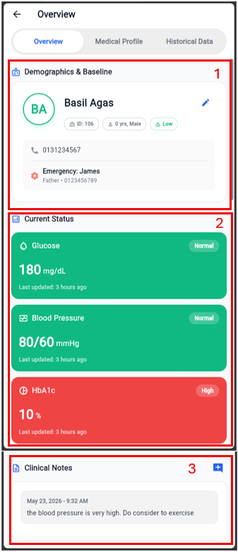

---

### 3.2 Understanding the Overview Tab
1.  **Demographics & Baseline [Box 1]**: Displays essential patient identifiers, age, gender, and emergency contact details. It also features an **Edit** button (pencil icon) to update profile details.
2.  **Current Status Grid [Box 2]**: A stack of vital metrics cards showing the latest logged values. Each card is colour-coded by its current risk status:
    *   **Green (Normal)**: On track and within target thresholds.
    *   **Amber (Elevated/Low)**: Out of range; requires monitoring.
    *   **Red (High/Critical)**: Significantly out of range; requires immediate clinical review.
    *   **Grey (No Data)**: No readings logged yet.
3.  **Clinical Notes [Box 3]**: Displays persistent, chronological notes from you and your clinical team. Tap the **Add Note** icon to append a new entry.

---

## 4. Historical Data & Dynamic Analytics

### 4.1 Navigating to Historical Data
To view detailed trends and long-term patient data, navigate to the **Historical Data** tab.

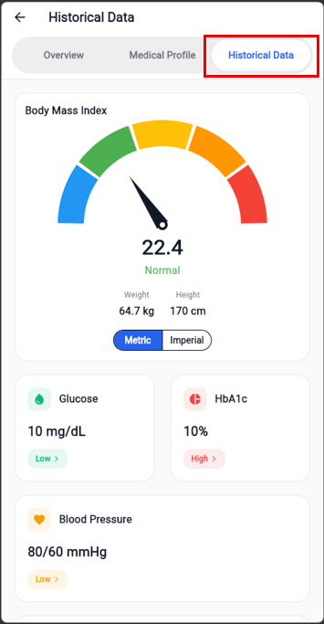

---

### 4.2 Glucose Analytics Screen
Clicking on the **Glucose** summary card in the **Historical Data** tab opens the dedicated Glucose Analytics Screen.

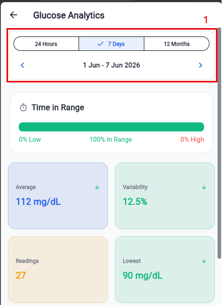
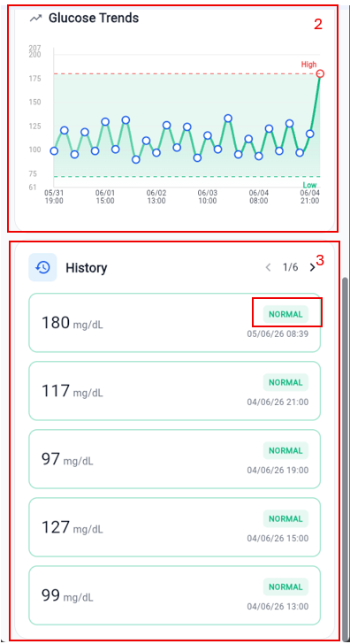

#### **Key Features:**
1.  **Timeframe Filters [Box 1]**: Toggle between daily, weekly, and monthly views. Use the chevron arrows to navigate back and forth in time.
2.  **Smart Charts [Box 2]**: The charts dynamically scale their intervals so that even months of daily data remain readable without label overlap. Shaded bands represent the patient's personalised target safe zones.
3.  **Status Pills [Box 3]**: Below the charts, individual logged entries are listed chronologically and flagged with status pills (e.g., "ABOVE TARGET", "BELOW TARGET", "NORMAL") for rapid clinical assessment.

---

### 4.3 HbA1c Analytics Screen
Clicking on the **HbA1c** summary card in the **Historical Data** tab opens the dedicated HbA1c Analytics Screen.

#### **Key Features:**
1.  **Actual vs. Goal [Box 1]**: A clean, side-by-side bar chart comparing the patient's latest HbA1c reading against their target. A status card below immediately flags whether they are within target.
2.  **HbA1c Trends [Box 2]**: A line chart showing long-term control over months. Shaded bands represent the patient's target safe zones.
3.  **Status Pills [Box 3]**: Below the charts, individual logged entries are listed chronologically and flagged with status pills (e.g., "ABOVE TARGET", "BELOW TARGET", "NORMAL") for rapid clinical assessment.

---

### 4.4 Blood Pressure Analytics Screen
Clicking on the **Blood Pressure** summary card in the **Historical Data** tab opens the dedicated Blood Pressure Analytics Screen.

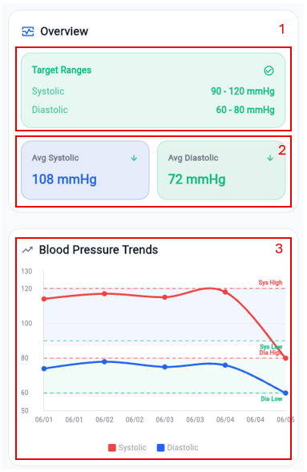
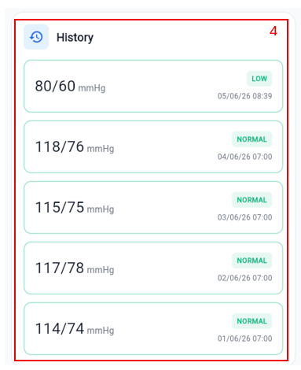

#### **Key Features:**
1.  **Target Ranges [Box 1]**: Displays the patient's personalised target ranges for both Systolic and Diastolic pressure.
2.  **Averages [Box 2]**: Displays the patient's average Systolic and Diastolic pressure for the selected period.
3.  **Blood Pressure Trends [Box 3]**: A line chart showing both Systolic and Diastolic lines. Shaded bands represent the patient's target safe zones.
4.  **Status Pills [Box 4]**: Below the charts, individual logged entries are listed chronologically and flagged with status pills (e.g., "HIGH", "NORMAL", "LOW") for rapid clinical assessment.

---

### 4.5 Cholesterol Analytics Screen
Clicking on the **Cholesterol** summary card in the **Historical Data** tab opens the dedicated Cholesterol Analytics Screen.

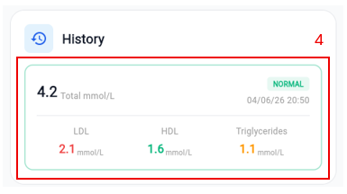

#### **Key Features:**
1.  **Cholesterol Ratio [Box 1]**: A clean, circular gauge comparing the patient's HDL against their Non-HDL cholesterol. A status card below immediately flags whether they are within target.
2.  **Metric Selector [Box 2]**: Toggle between Total, LDL, HDL, and Triglycerides views.
3.  **Cholesterol Breakdown [Box 3]**: A line chart showing long-term control over months. Shaded bands represent the patient's target safe zones.
4.  **Status Pills [Box 4]**: Below the charts, individual logged entries are listed chronologically and flagged with status pills (e.g., "HIGH", "NORMAL", "LOW") for rapid clinical assessment.

---

### 4.6 Physical Activity Analytics Screen
Clicking on the **Physical Activity** summary card in the **Historical Data** tab opens the dedicated Physical Activity Analytics Screen.

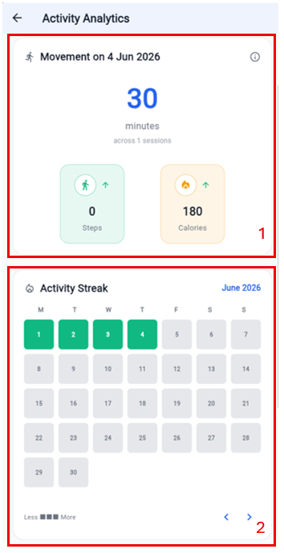

#### **Key Features:**
1.  **Today's Movement [Box 1]**: Displays the patient's active minutes and sessions for today.
2.  **Activity Streak [Box 2]**: A 28-day heatmap grid showing a visual representation of the patient's activity. Green represents active days, light green represents less active days, and grey represents inactive days.
3.  **Weekly Consistency [Box 3]**: A bar chart showing the patient's steps vs target. Green represents days where the target was met, amber represents days where the target was partially met, and red represents days where the target was not met.

---

### 4.7 Diet Log & Nutrition Summary
Clicking on the **Diet Log** summary card in the **Historical Data** tab opens the dedicated Diet Log & Nutrition Summary Screen.

#### **Key Features:**
1.  **Diet Log List [Box 1]**: Displays the patient's logged meals chronologically. Each entry shows the meal type, timestamp, and food items.
2.  **Nutrient Chips [Box 2]**: Displays the patient's macronutrient breakdown for each meal.
3.  **Automated Actions Log [Box 3]**: Displays the patient's automated actions log. Each entry shows the action type, timestamp, and description.

---

## 5. Taking Clinical Action

### 5.1 Managing Medical Conditions & Medications
Navigate to the **Medical Profile** tab to manage the patient's clinical background, target thresholds, and active prescriptions. This tab serves as the clinical core for personalising patient care.

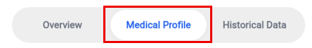

---

#### **Detailed Button Functions & Clinical Workflows:**

##### **1. Medical Conditions Card [Box 1]**

This card displays the patient's active and resolved diagnoses.
*   **Add New Condition Button (Plus Icon)**: Tap this button to open the **Add Medical Condition** dialog.
    *   *Condition Name*: Enter the diagnosis (e.g., "Type 2 Diabetes", "Hypertension").
    *   *Status Context Dropdown*: Select **Active** (for ongoing management) or **Resolved** (for historical context).
    *   *Diagnosed Date*: Tap to open a calendar date picker to log the exact onset date.
    *   *Add Entry Button*: Submits the record to the backend, immediately updating the patient's clinical profile.
*   **Active / Resolved / All Segmented Filter**: Tap these segments to instantly filter the list. This helps you quickly isolate active issues during a consultation without being distracted by resolved history.
*   **More Options Button (Three-Dot Icon)**: Located next to each condition. Tap this to open a context menu:
    *   *Mark as Resolved / Active*: Instantly toggles the condition's status and moves it to the appropriate filtered list.
    *   *Edit Details*: Re-opens the dialog to correct names or onset dates.
    *   *Remove*: Permanently deletes the condition from the patient's record after a confirmation prompt.
---
##### **2. Health Thresholds Card [Box 2]**

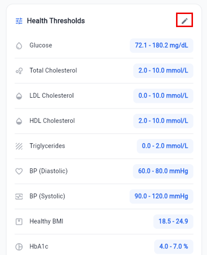
This card displays the patient's personalised target ranges for vitals (Glucose, Blood Pressure, HbA1c, Cholesterol, and BMI). These thresholds are critical because the **Dynamic Risk Engine** uses them to calculate the patient's risk level and float them to the top of the home screen queue.
*   **Edit Button (Pencil Icon)**: Tap this to open the **Health Thresholds** management dialog.
    *   *Threshold List*: Displays all vitals with their current min/max values.
    *   *Edit Single Threshold (Pencil Icon)*: Tap the edit icon next to any vital (e.g., Glucose) to open the **Edit Threshold** dialog.
    *   *Minimum / Maximum Value Fields*: Enter the new clinical targets. The units automatically match your preferred clinician settings (e.g., mmol/L or mg/dL).
    *   *Save Button*: Securely updates the targets via the REST API. The patient's app and the risk engine sync instantly.
---
##### **3. Current Medications Card [Box 3]**

This card displays the patient's active prescriptions and schedule.
*   **Add New Medication Button (Plus Icon)**: Tap this to open the comprehensive **Add Medication** form.
    *   *Medication Name (Smart Autocomplete)*: Start typing a brand or generic name. The field queries the global medication dictionary in real-time to prevent spelling errors and ensure clinical accuracy. You can also type a custom name if it is not in the dictionary.
    *   *Amount & Type*: Enter the dosage quantity (e.g., "1", "500") and select the form (e.g., "Tablet", "Capsule", "Injection", "ml").
    *   *Frequency Dropdown*: Select how often the medication should be taken (e.g., "Twice daily", "Three times daily").
    *   *Specific Timings (Dynamic Fields)*: The form dynamically generates dropdown fields based on your selected frequency (e.g., showing "1st Dose" and "2nd Dose" for twice-daily frequency). Select precise clinical instructions for each dose (e.g., "BEFORE_BREAKFAST", "AFTER_DINNER", "BEFORE_BED").
    *   *Add Medication Button*: Saves the prescription. This automatically generates a daily logging schedule in the patient's mobile app.
*   **More Options Button (Three-Dot Icon)**: Located next to each medication. Tap this to:
    *   *Edit Details*: Modify dosage, frequency, or timing instructions.
    *   *Remove*: Discontinue and delete the medication from the patient's active schedule.

---

### 5.2 Adding Clinical Notes
To record observations, treatment adjustments, or consultation summaries, tap the **Add Note** button on the patient's Overview tab.

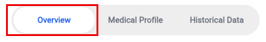
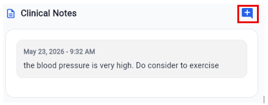
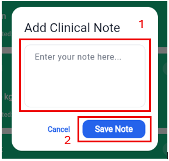

#### **Clinical Actions:**
1.  **Enter Note [Box 1]**: Type your clinical observations or treatment adjustments.
2.  **Save Note [Box 2]**: Tap **Save Note**. Because the dashboard operates on a strict "Zero Direct Database" policy, your note is securely routed through the FLORENCE middleware REST API. The note immediately syncs across the platform, updating the priority queue and context for your entire clinical team in real-time.

---

## 6. Clinician Profile & Preferences

### 6.1 Accessing the Profile
To view your account details, update your personal information, or modify your unit preferences, tap the **Profile** icon in the top-right corner of the Home Screen.

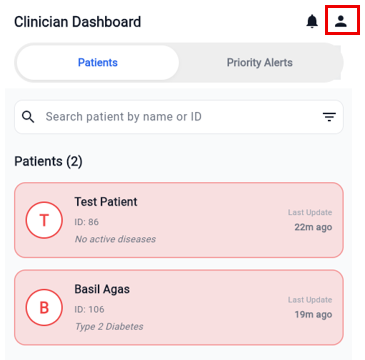
#### **Image Highlight Instructions (No image file, text-only directions for UI layout):**
Please capture a screenshot of the **Clinician Profile** screen and overlay **four red highlight boxes**, numbered as follows:
*   **[Box 1]** Around the **Account Information Card** (containing your name, gender, and mobile number) with the **Edit Profile** button.
*   **[Box 2]** Around the **Unit Preferences Card** (containing Glucose Unit and Cholesterol Unit selectors).
*   **[Box 3]** Around the **System Information Card** (containing your email and Organisation ID).
*   **[Box 4]** Around the **Logout Button** at the bottom.

---

#### **Detailed Card Descriptions & Clinical Actions:**

##### **1. Account Information Card [Box 1]**
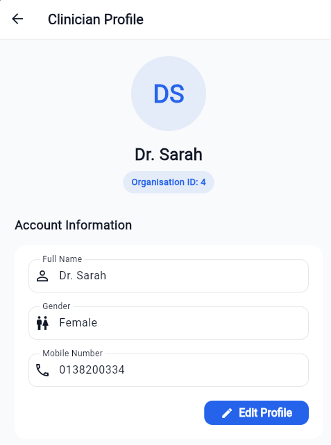
This card displays your personal clinical identity details used across the platform.
*   **What it is**: A secure card containing your editable profile details: **Full Name**, **Gender**, and **Mobile Number**.
*   **What it does**: Allows you to keep your contact details and identity up to date so that patients and other clinical staff can identify and contact you correctly.
*   **How to use it**:
    1.  Tap the **Edit Profile** button in the bottom-right corner of the card. The fields will switch from read-only to editable text fields.
    2.  Modify your **Full Name** or **Mobile Number** as needed.
    3.  Select your **Gender** from the dropdown menu.
    4.  Tap **Save Changes** to commit the updates to the backend database via the REST API, or tap **Cancel** to discard your edits and restore the previous values.

##### **2. Unit Preferences Card [Box 2]**

This card controls how clinical metrics are displayed to you throughout the entire dashboard.
*   **What it is**: A preference card containing selectors for **Glucose Unit** and **Cholesterol Unit**.
*   **What it does**: Customises the display units for all patient vitals across the dashboard. Changing these units automatically converts and displays all historical readings, charts, and thresholds in your preferred format (e.g., converting glucose from mmol/L to mg/dL) without altering the underlying base data in the database.
*   **How to use it**:
    1.  Tap the **Glucose Unit** row to open a bottom sheet selector. Choose between **mmol/L** and **mg/dL**.
    2.  Tap the **Cholesterol Unit** row to open a bottom sheet selector. Choose between **mmol/L** and **mg/dL**.
    3.  The platform instantly recalculates and updates all charts, tables, and status cards across the app. The preferences are saved to your profile via the REST API and persist across logins.

##### **3. System Information Card [Box 3]**
This card displays your immutable system credentials and organisational context.
*   **What it is**: A read-only card displaying your registered **Email Address** and **Organisation ID**.
*   **What it does**: Provides essential system context. The **Email Address** is your unique login identifier, and the **Organisation ID** links your account to your specific healthcare facility, determining which patients and priority alerts you have permission to access.
*   **How to use it**: This card is strictly read-only for security and audit purposes. If your email or organisation assignment needs to be changed, please contact your system administrator.

##### **4. Logout Button [Box 4]**
This button allows you to securely terminate your active session.
*   **What it is**: A prominent, red-outlined button at the bottom of the profile screen.
*   **What it does**: Instantly invalidates your active Supabase authentication session, clears cached patient data from the device memory to prevent unauthorised access, and returns you to the secure login screen.
*   **How to use it**:
    1.  Tap the **Logout** button.
    2.  A confirmation dialog will appear asking: *"Are you sure you want to sign out?"*
    3.  Tap **Sign Out** to confirm. You will be immediately redirected to the login screen.

---

### 6.2 Modifying Unit Preferences (Glucose & Cholesterol)
The FLORENCE platform supports both metric and imperial units for clinical data. You can customise these preferences to match your clinical practice.

#### **Clinical Actions:**
1.  **Glucose Unit [Box 2]**: Tap the **Glucose Unit** row. A bottom sheet will appear allowing you to select between **mmol/L** and **mg/dL**. Once selected, all glucose readings across the dashboard will automatically convert and display in your preferred unit.
2.  **Cholesterol Unit [Box 2]**: Tap the **Cholesterol Unit** row. A bottom sheet will appear allowing you to select between **mmol/L** and **mg/dL**. Once selected, all cholesterol readings across the dashboard will automatically convert and display in your preferred unit.
3.  **Automatic Sync**: Any changes made to your unit preferences are immediately saved to your profile via the FLORENCE middleware REST API and will persist across sessions.
