# FLORENCE: Patient App - User Manual

## 1. Introduction
Welcome to the FLORENCE Patient App. FLORENCE is an AI-powered health companion designed to monitor chronic conditions, guide daily habits and alert the patient and the clinician when things go out of range. It supports the patient every single day between doctor visits.

FLORENCE is also built to be easy to read and comfortable to use for patients of all ages, with large text and clear, high-contrast colours throughout.

## 2. Getting Started
### 2.1 Login / Registration

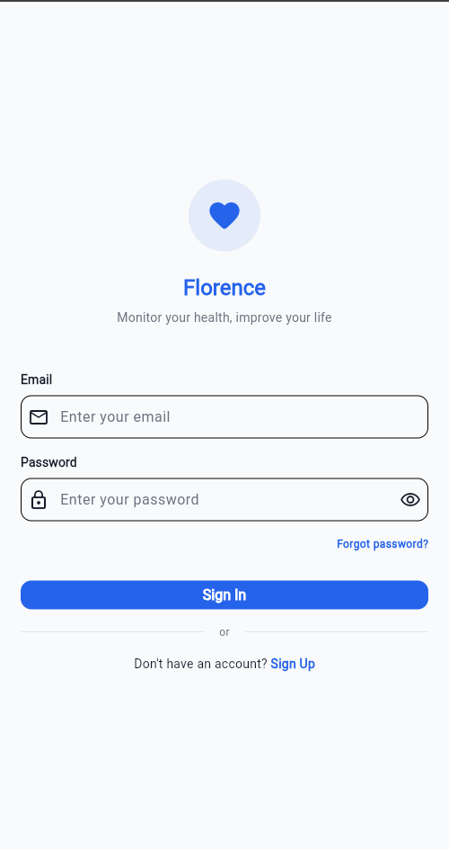

*Figure 1: The login screen.*

- The patient opens the FLORENCE app on the device.
- The patient logs in using a registered email and password.
- New patients follow the on-screen prompts to set up a profile, including baseline health metrics (Height, Weight and Condition).

### 2.2 The Dashboard
Upon opening the app, the patient is presented with a unified health dashboard:

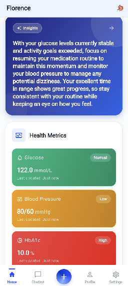

*Figure 2: The dashboard, with the AI Daily Insight and health metric cards.*

- **AI Daily Insight**: A concise, AI-generated summary of the patient's current health status and focus areas, refreshed from the most recent logs (for example, noting that glucose is stable and prompting the patient to maintain the medication routine). It provides key takeaways the moment the app is opened, so the patient is informed without needing to dig through the data. Tapping the insight banner opens the full **Insights** screen with the Vitality Index and recommendations. The insight appears once some data has been logged and sharpens as more is added.
- **Health Metric Cards**: Quick glances at Glucose, Blood Pressure, HbA1c, BMI and other tracked vitals, each colour-coded by status (for example Normal or High).
- **Streaks & Habits**: Visual indicators of medication adherence and logging consistency.

When a patient is new and has not logged any data yet, the dashboard displays a friendly prompt inviting the patient to start logging:

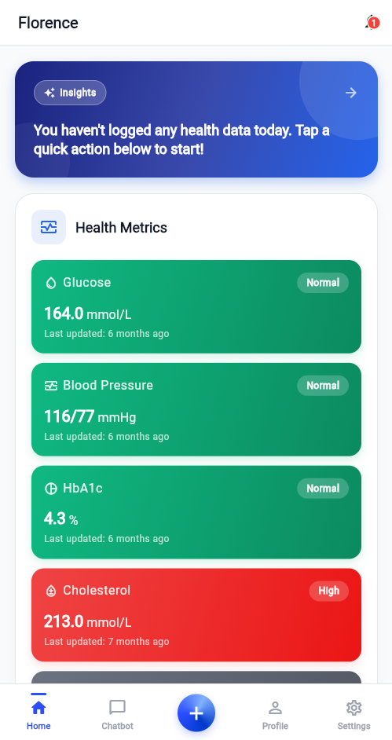

*Figure 3: The dashboard before any data is logged.*

### 2.3 Navigating the App
The bottom navigation bar gives quick access to the main areas of FLORENCE:
- **Home**: the dashboard, with the AI Daily Insight and health metric cards.
- **Chatbot**: the AI health assistant.
- **Centre (+) button**: opens the "Log Health Data" menu to record a new reading.
- **Profile**: allows the patient to view and edit a personal and health profile.
- **Settings**: allows management of preferences, including how often FLORENCE checks data and signing out.

## 3. Logging Data
Logging daily health data is crucial for FLORENCE to understand patient patterns.

### 3.1 Vital Health Data
- The patient navigates to the **Log Data** section.
- The patient selects the vital to log (Blood Glucose, HbA1c, Blood Pressure, Cholesterol, Activity or BMI).
- The patient enters the value and the time of the reading, then taps **Save**.

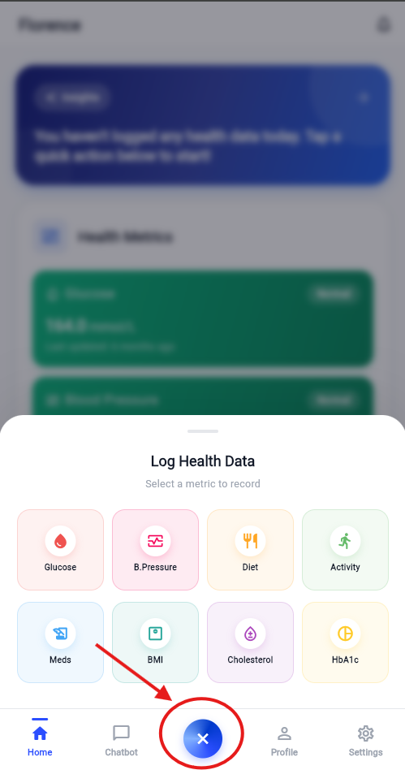

*Figure 4: The Log Health Data menu, where you choose which vital to record.*

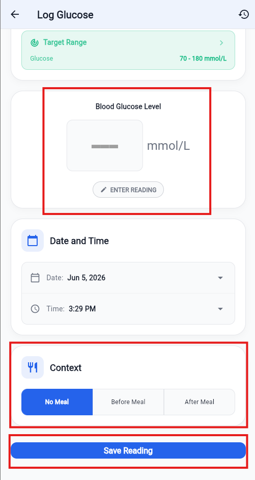

*Figure 5: Entering a vital reading.*

### 3.2 Meals & Meal Vision AI
- **Manual Entry**: The patient types in the food consumed and its estimated calories.
- **Meal Vision**: The patient taps the camera icon and takes a photo of the meal. FLORENCE's AI analyses the image, identifies the food and estimates the calories and macronutrients (carbohydrates, protein and fat), then logs them automatically. The patient can review and adjust any value before saving, maintaining control of what gets recorded. No manual typing is required.

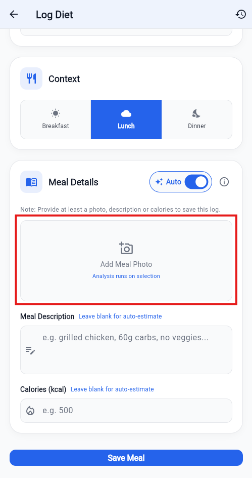

*Figure 6: Logging a meal.*

### 3.3 Medication
- Prescribed medications can be added to the schedule.
- Daily dosage reminders are received.
- Tapping the checkmark next to a medication logs it as taken, maintaining the adherence streak.

### 3.4 Health Records & Lab Reports
- **Symptoms**: The patient can log any unusual symptoms experienced.
- **Lab Report Reader**: The patient taps **Upload Report** and takes a photo of the physical blood test or lab results. FLORENCE's AI reads the document and extracts the key metrics (for example HbA1c, total cholesterol, LDL, HDL and triglycerides), logs each value to the correct place and explains in plain language what the numbers mean for the patient's condition. This saves the patient from typing results in by hand and helps the patient understand them without medical jargon.

## 4. AI Features & Guidance
The **Insights** screen is a personal AI guidance hub. It is opened by tapping the AI Daily Insight banner at the top of the dashboard.

### 4.1 Vitality Index & Personalised Recommendations

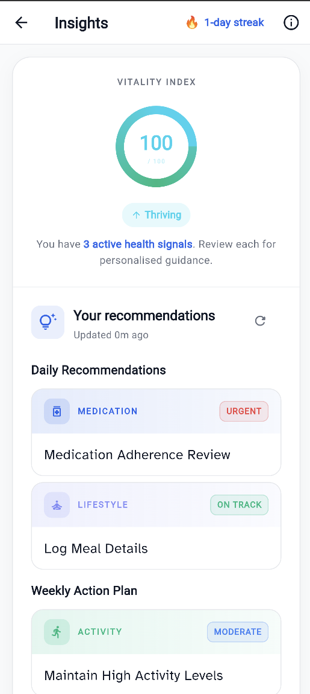

*Figure 7: The Insights screen, with the Vitality Index and recommendations.*

At the top of the Insights screen, the **Vitality Index** provides a single score out of 100 that sums up how on-track health is right now, shown as a coloured ring with a status label:
- **Thriving** (75 and above): the patient is doing really well.
- **Rising** (50 to 74): solid progress, with a few areas to improve.
- **Straining** (30 to 49): several areas need attention.
- **Depleted** (below 30): the patient needs to focus on the basics.

The score reflects four things: how often glucose stays in range, physical activity, medication adherence and how consistently data is logged. Tapping the **information (i) icon** in the header opens "About Insights & Vitality Index", which explains exactly how the score is calculated. Just below the ring, FLORENCE displays how many **active health signals** have been found in recent logs.

If the patient is new and has not logged anything yet, the Vitality Index starts at 0 with a "Depleted" label and FLORENCE invites the patient to begin logging. As soon as the first readings are recorded, the score and recommendations come to life.

FLORENCE then turns those signals into clear, prioritised actions, grouped into two sections:
- **Daily Recommendations**: the most important things to act on today.
- **Weekly Action Plan**: longer-term habits to maintain or build.

Each recommendation card shows:
- A **category** (for example Medication, Meal, Activity, Sleep, Lifestyle or Timing),
- A **priority pill** showing how urgent it is, from **Urgent** (act now), through **Moderate**, down to **On Track** (the patient is doing well and should keep it up),
- A short, actionable title, such as "Medication Adherence Review" or "Maintain High Activity Levels".

Tapping any recommendation card expands it to reveal the full detail:

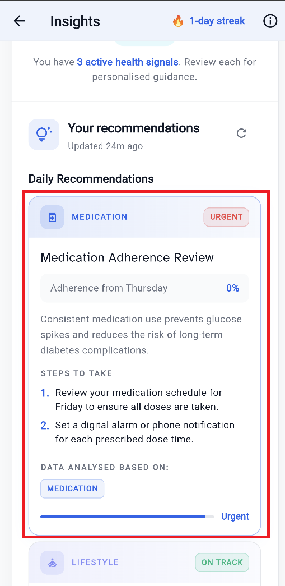

*Figure 8: An expanded recommendation card.*

- A key **metric** behind the recommendation (for example "Adherence from Thursday: 0%").
- A short **explanation** of why it matters (for example how consistent medication use prevents glucose spikes and reduces long-term risk).
- **Steps to Take**: clear, numbered actions to follow right away.
- **Data Analysed Based On**: the type of data FLORENCE used to generate the recommendation, showing what is being responded to.

For example, if glucose is high at night, FLORENCE might recommend a 15-minute post-dinner walk.

**Recommendation History.** Once a recommendation has been acted on or is no longer current, it moves into a **History** section further down the screen, allowing past guidance to be reviewed.

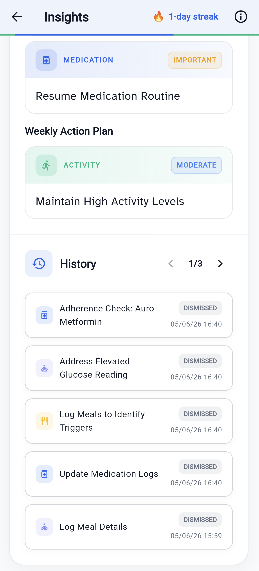

*Figure 9: The Recommendation History, with past recommendations across multiple pages.*

**Keeping recommendations up to date.** FLORENCE refreshes the Daily Recommendations about once a day, or sooner if new data is logged, and the Weekly Action Plan about once a week. When the guidance is due for an update, a "Stale, tap to refresh" hint is displayed. Because recommendations are generated from logged data, the more data is logged, the more tailored they become. Tapping the **refresh** icon next to a section regenerates it at any time.

### 4.2 AI Health Chatbot

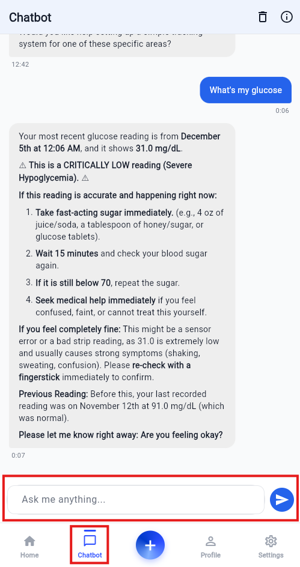

*Figure 10: The AI Health Chatbot.*

- Tapping the **Chat** icon opens the conversation with FLORENCE.
- Health-related questions can be asked in plain language, for example "Why was glucose high after dinner?" or "What does the latest HbA1c mean?".
- FLORENCE has access to the medical history and recent logs, so it answers in the context of the patient's specific condition instead of giving generic advice.
- The conversation is saved so it can be resumed later, and it can be cleared at any time.
- FLORENCE is a guidance and education tool. It will not diagnose the patient or change a prescription. For those decisions, it will always point the patient back to the clinician.

### 4.3 Smart Notifications

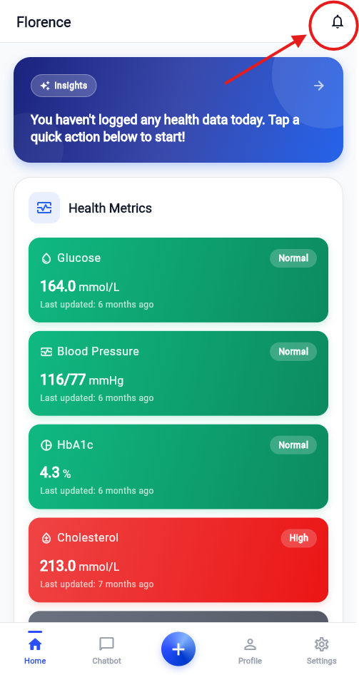

*Figure 11: Smart notifications.*

FLORENCE monitors data in two ways so nothing important is missed:
- **Right after logging**: if a reading is out of the safe range (for example a very high or low glucose or high blood pressure), FLORENCE alerts the patient straight away with what happened and what to do about it.
- **In the background**: FLORENCE also reviews recent logs on a regular schedule to catch developing patterns, even when the app is not actively being used.
- **Achievements**: encouraging notifications are received for hitting logging streaks and reaching health targets.

The frequency of background checks can be adjusted from the notification settings.

## 5. Understanding FLORENCE's AI

FLORENCE uses AI to make health data easier to understand and act on. Here is what that means for the patient.

- **It works from logged data.** Every insight, recommendation and chatbot answer is based on the health information logged. The more consistently data is logged, the more accurate and tailored FLORENCE becomes.
- **It is a guide, not a doctor.** FLORENCE helps the patient understand data and build better habits, but it does not diagnose conditions or change medication. For any medical decision, it will encourage the patient to speak with the clinician.
- **Data stays private.** Information is kept secure and is never shared publicly. The AI only ever uses the data needed to help the patient, and only the patient and the assigned clinician can see the records.
- **The AI has been safety-tested.** Before release, FLORENCE's AI features were tested against deliberate attempts to trick them into giving unsafe or off-topic advice and against revealing private data. The AI resisted these attempts, so it can be trusted to stay focused on supporting health.
- **Always sense-check AI estimates.** Features like Meal Vision and the Lab Report Reader give best-effort estimates from a photo. They are designed to save typing, so the patient should review the values before saving and confirm anything important with the clinician.

## 6. Getting Help

If something does not look right, these steps usually help:
- **A reading looks wrong.** The patient can open the metric from the dashboard, check the logged entry and edit or re-log it if needed.
- **Recommendations or insights seem out of date.** Tapping the refresh icon on the Insights screen regenerates them from the latest data.
- **Notifications are not being received.** Ensure notifications are enabled for FLORENCE in the device settings, then check the Health Check Interval in the app's Settings.
- **Details need to be updated.** The patient can edit the personal or health profile from the Profile tab.
- **Data and privacy.** Records are private to the patient and the assigned clinician. To request changes to the account or data, the clinic or the FLORENCE support team should be contacted.

Remember that FLORENCE supports care between visits, but it does not replace the clinician. For any medical concern, the healthcare provider should be contacted.
