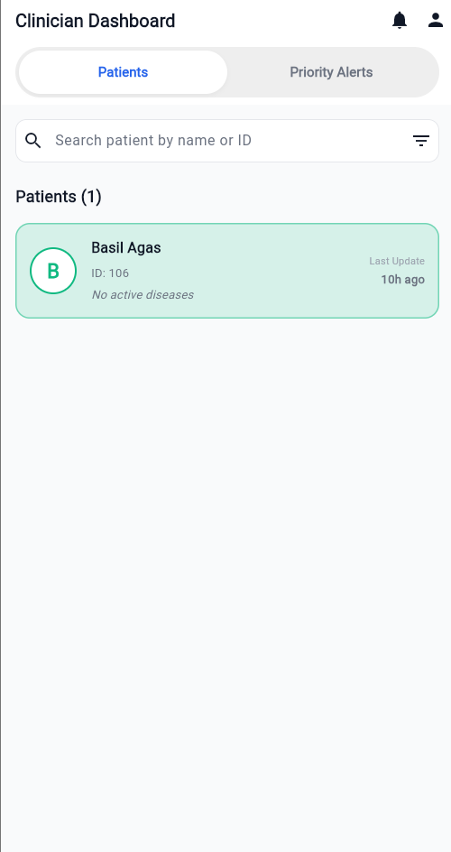
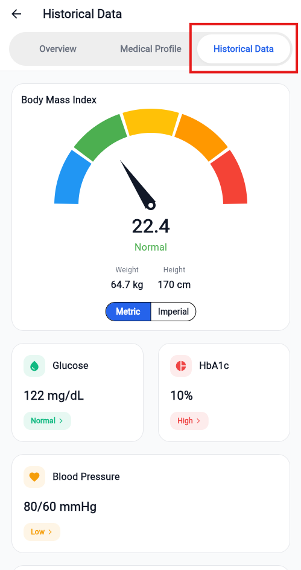
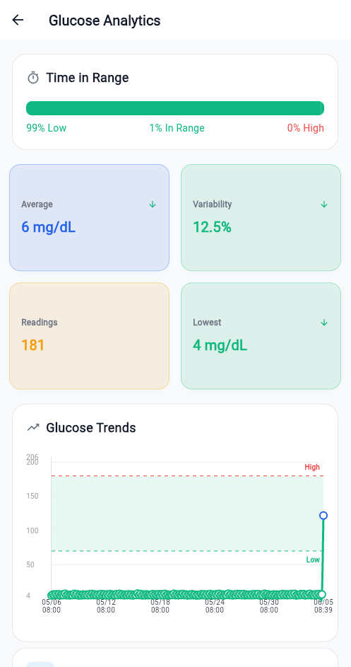

# FLORENCE Clinician Dashboard — User Manual

## 1. Introduction
The FLORENCE Clinician Dashboard is built for speed and secured for healthcare. It provides medical professionals with a streamlined, high-priority command centre that turns scattered patient logs into actionable clinical insights. The goal: Less noise. More signal.

---

## 2. Dashboard & Dynamic Risk Engine (Home Screen)

### 2.1 Overview of the Home Screen
Upon logging in, you are presented with the main command centre. This screen is designed to highlight patients requiring immediate attention.

#### **Image Highlight Instructions:**
Please overlay **three red highlight boxes** on the image above, numbered as follows:
*   **[Box 1]** Around the **Search Bar & Filter Icon** at the top.
*   **[Box 2]** Around the **Patients List** on the left-hand side.
*   **[Box 3]** Around the **Priority Alerts Panel** on the right-hand side.

---

### 2.2 Key Features of the Home Screen
1.  **Search & Filter [Box 1]**: Quickly find patients by typing their name or ID. Tap the filter icon to expand advanced filters (e.g., filtering by specific risk levels or update recency).
2.  **Dynamic Sorting [Box 2]**: The patient list is NOT alphabetical. It is driven by a live Dynamic Risk Engine. Patients flagged as "High" or "Medium" risk automatically float to the top of your queue based on real-time continuous data flows from their patient app.
3.  **Priority Alerts [Box 3]**: If a patient breaches critical thresholds (e.g., consecutive fasting glucose readings > 10.0 mmol/L or hypertensive crisis readings), a **Priority Alert** card appears here. It displays the patient's name, the specific trigger, and the time elapsed. Tap **View Details** to investigate immediately.

---

## 3. Patient Overview & Demographics

### 3.1 Holistic Patient View
Clicking on any patient from your list opens their comprehensive profile, defaulting to the **Overview** tab.

#### **Image Highlight Instructions:**
Please overlay **three red highlight boxes** on the image above, numbered as follows:
*   **[Box 1]** Around the **Demographics & Baseline Card** at the top (containing the patient's name, ID, age, gender, risk level, and emergency contact details).
*   **[Box 2]** Around the **Current Status Grid** (the stack of vital metrics cards: Glucose, Blood Pressure, HbA1c, Cholesterol, Activity, BMI, and Diet).
*   **[Box 3]** Around the **Clinical Notes Section** at the bottom.

---

### 3.2 Understanding the Overview Tab
1.  **Demographics & Baseline [Box 1]**: Displays essential patient identifiers, age, gender, and emergency contact details. It also features an **Edit** button (pencil icon) to update profile details.
2.  **Current Status Grid [Box 2]**: A stack of vital metrics cards showing the latest logged values. Each card is color-coded by its current risk status:
    *   **Green (Normal)**: On track and within target thresholds.
    *   **Amber (Elevated/Low)**: Out of range; requires monitoring.
    *   **Red (High/Critical)**: Significantly out of range; requires immediate clinical review.
    *   **Grey (No Data)**: No readings logged yet.
3.  **Clinical Notes [Box 3]**: Displays persistent, chronological notes from you and your clinical team. Tap the **Add Note** icon to append a new entry.

---

## 4. Historical Data & Dynamic Analytics

### 4.1 Navigating to Historical Data
To view detailed trends and long-term patient data, navigate to the **Historical Data** tab.

#### **Image Highlight Instructions:**
Please overlay **two red highlight boxes** on the image above, numbered as follows:
*   **[Box 1]** Around the **Tab Bar** at the top, highlighting the selected **Historical Data** tab.
*   **[Box 2]** Around the list of **Metric Summary Cards** (Glucose, HbA1c, Blood Pressure, Cholesterol, Physical Activity, Diet Log, and Automated Actions Log).

---

### 4.2 Accessing Specific Metric Analytics
Clicking on any of the summary cards in the **Historical Data** tab opens a dedicated, interactive Analytics Screen for that metric (e.g., Glucose Analytics).

#### **Image Highlight Instructions:**
Please overlay **three red highlight boxes** on the image above, numbered as follows:
*   **[Box 1]** Around the **Timeframe Segmented Control** (24 Hours, 7 Days, 12 Months) and date navigation arrows.
*   **[Box 2]** Around the **Interactive Line Chart** (including the shaded target range band and threshold lines).
*   **[Box 3]** Around the **History List** at the bottom, highlighting the status pills (e.g., "ABOVE TARGET", "NORMAL", "BELOW TARGET").

---

### 4.3 Key Features of the Analytics Screens
1.  **Timeframe Filters [Box 1]**: Toggle between daily, weekly, and monthly views. Use the chevron arrows to navigate back and forth in time.
2.  **Smart Charts [Box 2]**: The charts dynamically scale their intervals so that even months of daily data remain readable without label overlap. Shaded bands represent the patient's personalised target safe zones.
3.  **Status Pills [Box 3]**: Below the charts, individual logged entries are listed chronologically and flagged with status pills (e.g., "ABOVE TARGET", "BELOW TARGET", "NORMAL") for rapid clinical assessment.

---

## 5. Taking Clinical Action

### 5.1 Managing Medical Conditions & Medications
Navigate to the **Medical Profile** tab to manage the patient's clinical background and active prescriptions.

#### **Image Highlight Instructions (No image file, text-only directions for UI layout):**
*   **[Box 1]** Around the **Medical Conditions Card** (highlighting the "Add New Condition" button and the Active/Resolved/All filters).
*   **[Box 2]** Around the **Health Thresholds Card** (highlighting the "Edit" button).
*   **[Box 3]** Around the **Current Medications Card** (highlighting the "Add New Medication" button).

#### **Clinical Actions:**
*   **Add/Edit Conditions [Box 1]**: Tap the add icon to record a new diagnosis. Use the popup menu on existing conditions to mark them as resolved or edit details.
*   **Customise Thresholds [Box 2]**: Tap the edit icon to adjust the patient's personalised target ranges. These values are used by the Dynamic Risk Engine to calculate risk levels.
*   **Prescribe Medications [Box 3]**: Tap the add icon to open the medication form. Search the global dictionary, set the dosage, frequency, and specific timing instructions (e.g., "BEFORE_BREAKFAST").

---

### 5.2 Adding Clinical Notes
To record observations, treatment adjustments, or consultation summaries, tap the **Add Note** button on the patient's Overview tab.

#### **Image Highlight Instructions:**
Please overlay **two red highlight boxes** on the image above, numbered as follows:
*   **[Box 1]** Around the **Text Input Field** where the note content is entered.
*   **[Box 2]** Around the **Save Note** button.

#### **Clinical Actions:**
1.  **Enter Note [Box 1]**: Type your clinical observations or treatment adjustments.
2.  **Save Note [Box 2]**: Tap **Save Note**. Because the dashboard operates on a strict "Zero Direct Database" policy, your note is securely routed through the FLORENCE middleware REST API. The note immediately syncs across the platform, updating the priority queue and context for your entire clinical team in real-time.
