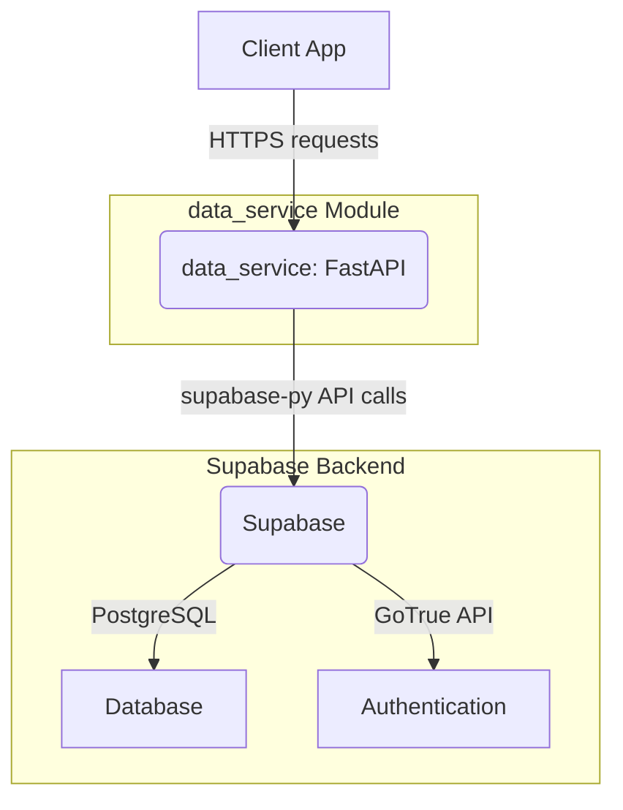
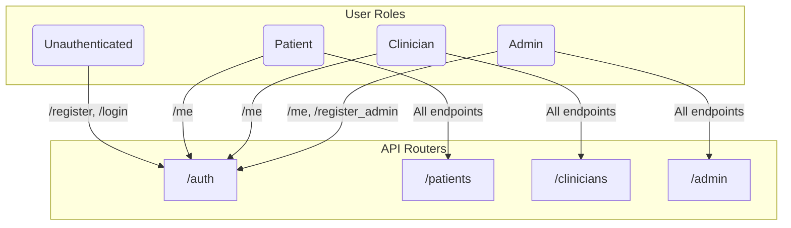
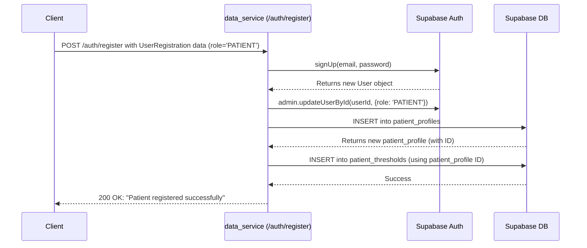
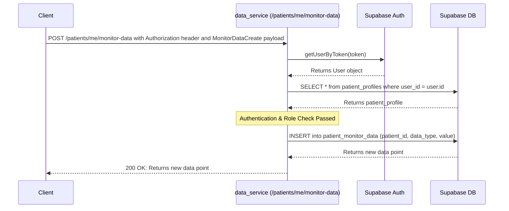
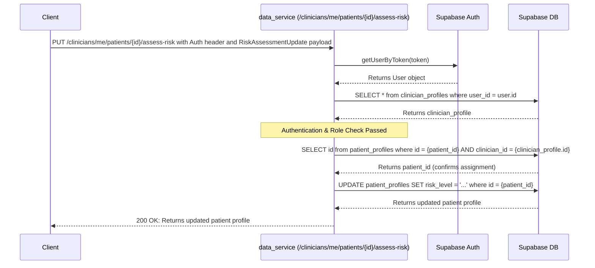

# Data Service Module

## 1. Introduction

The `data_service` module is the core backend API for the Florence digital health platform. It is built using the FastAPI framework and leverages Supabase for its database and authentication services. This module exposes a set of RESTful endpoints that the frontend client (the Florence Flutter application) consumes to manage users, patients, clinicians, and their associated health data.

Its primary responsibilities include:
- User authentication and role management (Patient, Clinician, Admin).
- CRUD (Create, Read, Update, Delete) operations for patient and clinician data.
- Recording and retrieving patient-generated health data (e.g., glucose levels, daily logs).
- Providing endpoints for clinicians to manage their assigned patients, add notes, and set health thresholds.
- Offering administrative endpoints for global data management.

## 2. Architecture

The architecture is centered around a classic three-tier model:

1.  **Client:** The frontend application that consumes the API.
2.  **Application Server:** The `data_service` itself, running FastAPI. It handles business logic, request validation, and orchestration.
3.  **Backend-as-a-Service (BaaS):** Supabase provides the PostgreSQL database, user authentication (Supabase Auth), and a data API that the service interacts with.

The `_SupabaseClientProxy` is a crucial internal component that ensures a single, lazily-initialized connection to the Supabase backend. This design pattern prevents connection issues during application startup and is vital for a stable and scalable service.

## 3. API Routers and Component Interaction

The API is organized into several routers based on functionality and user roles. Each router is protected by dependency-injection-based authentication and authorization checks, ensuring that users can only access data they are permitted to see.

- **/auth**: Handles user registration, login, and session management.
- **/patients**: Provides self-service endpoints for patients to manage their own data.
- **/clinicians**: Provides endpoints for clinicians to manage their assigned patients.
- **/admin**: Provides global management endpoints for administrative users.

## 4. Process Flows

### 4.1. New Patient Registration

This flow shows how a new user with the `PATIENT` role is created, their profile is set up in the database, and default health thresholds are applied. The process involves multiple steps to ensure data integrity.

### 4.2. Patient Data Submission

This flow illustrates a logged-in patient submitting a new health data point. The API first authenticates the user via their JWT and verifies their patient status by checking for a corresponding profile in the database before recording the data.

### 4.3. Clinician Updates Patient Risk

This flow shows a clinician updating the risk level for a patient assigned to them. The API validates the clinician's identity and their relationship with the patient before applying the change. This ensures clinicians can only manage patients under their care.

## 5. Dependencies

- **FastAPI:** The web framework used to build the API.
- **Pydantic:** Used for data validation and settings management.
- **supabase-py:** The official Python client library for interacting with Supabase.
- **python-dotenv:** For loading environment variables from a `.env` file.

## 6. Configuration

The service requires the following environment variables to be set in a `.env` file at the project root:
- `SUPABASE_URL`: The URL of the Supabase project.
- `SUPABASE_SERVICE_KEY`: The service role key for administrative access to the Supabase backend.
