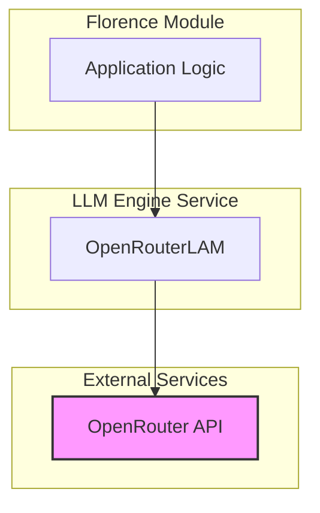
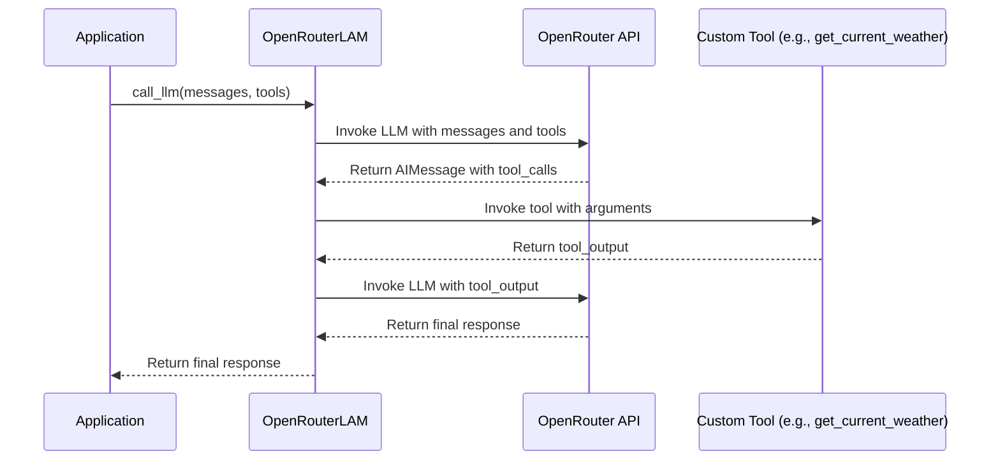

# LLM Engine Service Documentation

## 1. Introduction

The `llm_engine_service` is responsible for providing Large Language Model (LLM) capabilities to the Florence application. It uses the OpenRouter API to access various language models and is built using the LangChain library to manage interactions with the LLM, including tool-calling functionality.

## 2. Architecture

The `llm_engine_service` is a client that connects to the OpenRouter API. It is designed to be used by other services within the Florence module that require natural language processing.

**Figure 1: LLM Engine Service Architecture**

## 3. Core Components

- **`OpenRouterLAM`**: This is the main class in the `llm_engine_service`. It encapsulates the logic for interacting with the OpenRouter API. It uses `ChatOpenAI` from the `langchain_openai` library to make API calls. The class is initialized with an API key and a model name.

- **`WeatherArgs` and `get_current_weather`**: These are example components that demonstrate the tool-calling functionality of the `OpenRouterLAM`. The `WeatherArgs` class defines the arguments for the `get_current_weather` tool, which is a simple function that returns mock weather data. This showcases how the LLM can be extended with custom tools to perform specific tasks.

## 4. Data Flow

The data flow for a typical tool-calling scenario is as follows:

**Figure 2: Tool-Calling Data Flow**
