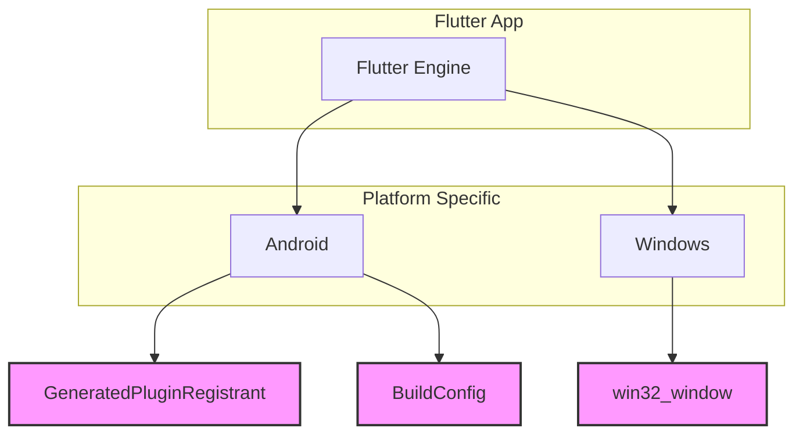
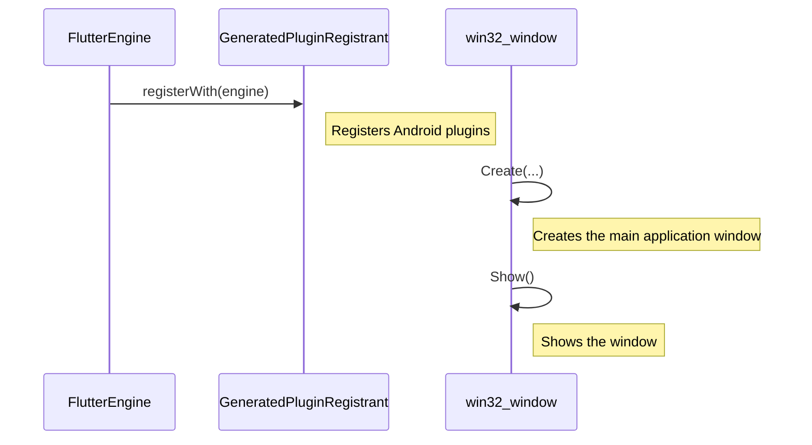

# Platform Service Documentation

## 1. Introduction

The `platform_service` module contains platform-specific code for the Florence mobile application. This includes native code for Android and Windows that interfaces with the Flutter front-end. This module is responsible for handling tasks that require native APIs, such as plugin registration and window management.

## 2. Architecture

The `platform_service` is structured by platform (Android, Windows) and contains generated code and manually written native code.

**Figure 1: Platform Service Architecture**

## 3. Core Components

### 3.1. Android

- **`GeneratedPluginRegistrant.java`**: This file is auto-generated by Flutter and is responsible for registering all the necessary plugins for the Android version of the app. This includes plugins for app links, lifecycle management, image picking, path providing, shared preferences, SQLite, and URL launching.

- **`BuildConfig.java`**: This is a standard Android build configuration file that contains settings for the build, such as whether it's a debug build and the library package name.

### 3.2. Windows

- **`win32_window.cpp`**: This file manages the main window of the Florence application on Windows. It handles window creation, message handling (like resizing and closing), and theme updates (like switching to dark mode). The `WindowClassRegistrar` class within this file is responsible for registering the window class with Windows.

## 4. Component Interaction

The `GeneratedPluginRegistrant` is called by the `FlutterEngine` to register the plugins. The `win32_window` is responsible for creating and managing the application window on Windows.

**Figure 2: Component Interaction**
