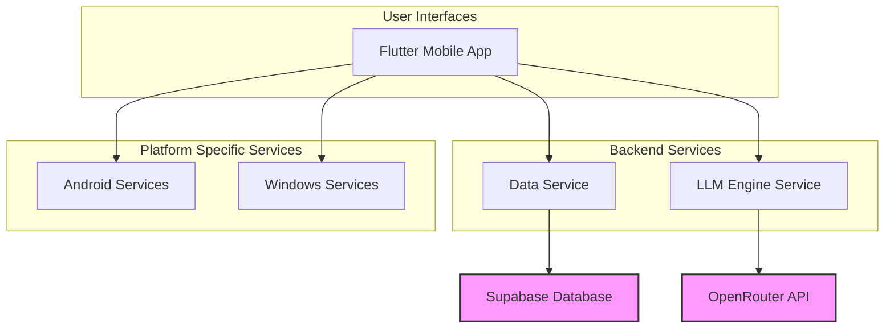

# Florence Module Documentation

## 1. Introduction

The Florence module is a comprehensive system designed for remote patient monitoring, particularly for chronic conditions like diabetes. It facilitates data exchange between patients, clinicians, and administrators, with a focus on real-time data collection, analysis, and intervention. The system is composed of a mobile application (built with Flutter), a backend data service, and an LLM engine for intelligent interactions.

## 2. Architecture Overview

The Florence module follows a microservices-oriented architecture, with distinct services for data management, platform-specific functionalities, and language model interactions.

**Figure 1: High-Level Architecture**

The core components are:

- **Flutter Mobile App**: The primary interface for patients and clinicians.
- **Data Service**: A FastAPI-based backend that manages all data interactions with the Supabase database. It handles user authentication, patient data, and clinician actions.
- **LLM Engine Service**: Provides natural language processing capabilities, likely for chatbot features or data interpretation, by interfacing with the OpenRouter API.
- **Platform Specific Services**: Contains code for native functionalities on Android and Windows, such as URL launching and plugin registration.

---

## 3. Sub-Module Documentation

Detailed documentation for each sub-module can be found in the following files:

- [Data Service](data_service.md)
- [Platform Service](platform_service.md)
- [LLM Engine Service](llm_engine_service.md)
- [Stale Patient Data Simulation Generator](stale_patient_data_simulation_generator.md)
